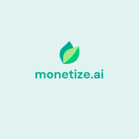

<a name="readme-top"></a>

<!-- PROJECT LOGO -->
<br />
<div align="center">
  <a>
    
  </a>

<h3 align="center">Monetize.ai</h3>

  <p align="center">
    Financial Chat Bot Advisor
    Project for Agile Web Development - CITS3403 unit at UWA 2023
    <br />
    <a href="https://github.com/KhanhHua2102/CITS3403-Project"><strong>Explore the docs »</strong></a>
    <br />
    <br />
    <a href="https://github.com/KhanhHua2102/CITS3403-Project">View Demo</a>
    ·
    <a href="https://github.com/KhanhHua2102/CITS3403-Project/issues">Report Bug</a>
    ·
    <a href="https://github.com/KhanhHua2102/CITS3403-Project/issues">Request Feature</a>
  </p>
</div>


<!-- TABLE OF CONTENTS -->
<details>
  <summary>Table of Contents</summary>
  <ol>
    <li>
      <a href="#about-the-project">About The Project</a>
      <ul>
        <li><a href="#built-with">Built With</a></li>
      </ul>
    </li>
    <li>
      <a href="#getting-started">Getting Started</a>
      <ul>
        <li><a href="#prerequisites">Prerequisites</a></li>
        <li><a href="#installation">Installation</a></li>
      </ul>
    </li>
    <li><a href="#usage">Usage</a></li>
    <li><a href="#roadmap">Roadmap</a></li>
    <li><a href="#contributing">Contributing</a></li>
    <li><a href="#contact">Contact</a></li>
    <li><a href="#acknowledgments">Acknowledgments</a></li>
  </ol>
</details>


<!-- ABOUT THE PROJECT -->
# About The Project
Monetize.ai is a web-based chat bot application that utilizes the GPT-3.5 language model and integrates with the Yahoo Finance API to crawl financial data such as stocks and cryptocurrencies. The application is built using the Flask framework and SQLite for the database on the server side. The client side is built using HTML, CSS, JavaScript with Bootstrap framework and jQuery for the client-side rendering.

The main objective of this project is to provide users with a personalized financial advisory service that can help them manage their investment portfolios in an efficient and effective manner. Users can declare their investment portfolios to the chat bot and receive advice on how to balance their portfolios using modern portfolio theory. The chat bot can also calculate profits/losses and provide other useful metrics related to the user's portfolio. All of the user's portfolio data is stored in the Portfolio section for future reference.

The Monetize.ai GitHub repository contains all the source code for the web-based application, including the chat bot implementation and the integration with the Yahoo Finance API. The application is built using Flask, a popular Python web framework, and the SQLite database for efficient and scalable data storage. The client-side rendering is done using HTML, CSS, JavaScript, and Bootstrap, making it easy to use and accessible across different devices.

The repository is organized into several modules, each responsible for a specific aspect of the application. The main module is the chat bot itself, which handles user queries and provides advice based on the user's portfolio data. Other modules include the Yahoo Finance API integration, database management, and modern portfolio theory calculations.

Monetize.ai is an open-source project, which means that anyone can contribute to it and help improve its functionality and features. The repository includes detailed documentation to help developers get started with the project and contribute code to it. There is also an active community of developers and users who can provide support and guidance on using the application.


<p align="right">(<a href="#readme-top">back to top</a>)</p>


### Built With

* [![Flask][Flask.com]][Flask-url]
* [![SQLite][SQLite.com]][SQLite-url]
* [![Bootstrap][Bootstrap.com]][Bootstrap-url]
* [![JQuery][JQuery.com]][JQuery-url]

<p align="right">(<a href="#readme-top">back to top</a>)</p>


<!-- GETTING STARTED -->
# Getting Started

### Prerequisites

* python 3.8 or newer

### Installation

#### Running the app locally by cloning the Github repo
1. Get a free OpenAI API Key at [https://platform.openai.com/account/api-keys](https://platform.openai.com/account/api-keys)
2. Clone the repo
   ```sh
   git clone https://github.com/KhanhHua2102/CITS3403-Project.git
   ```
3. Enter your OpenAI API in `config.py`
   ```js
   const API_KEY = 'ENTER YOUR OPEN_AI API';
   ```
4. Create a virtual environment for python:
    ```sh
    python3 -m venv env
    ```
    Then activate the virtual environment:

    On Window:
    ```sh
    myenv\Scripts\activate.bat
    ```
    On Mac/Linux:
    ```sh
    source env/bin/activate
    ```
5. Install the requirements for the app:
    ```sh
    pip install -r requirements.txt
    ```
6. Activate the virtual environment again
7. Run the app on your local host:
    ```sh
    flask run
    ```
This will run the Flask app on your local host, typically http://127.0.0.1:5000.

#### Running the app locally by using Docker
1. Pull the docker image from Docker Hub:
    ```sh
    docker pull khanhhua2102/monetize.ai
    ```
2. Run the docker image:
    ```sh
    docker run -p 5000:5000 khanhhua2102/monetize.ai
    ```
This will run the Flask app on your local host, typically http://127.0.0.1:5000.

<p align="right">(<a href="#readme-top">back to top</a>)</p>


<!-- USAGE EXAMPLES -->
# Usage

## Sign Up and Login

To get started, you will need to create an account by signing up on the website. Provide an email address and password to register. Once your account is created, you can login with your email and password.

## Interacting with the Chatbot

You can interact with the [Monetize.ai](http://monetize.ai/) chatbot by sending it messages through the chat interface. The chatbot understands a variety of finance-related questions and commands. Here are a few examples:

### General Questions:

Ask the chatbot broad questions about investing strategies, financial concepts, and stock markets. For example:

You: What are some common investing strategies?

Bot: There are many different investment strategies, including value investing, growth investing, income investing, and momentum investing. Each strategy has its own unique approach to selecting investments and managing risk. It's important to do your research and choose a strategy that aligns with your financial goals and risk tolerance.

### Update Your Portfolio:

Tell the chatbot when you buy or sell stocks by providing details like the stock ticker, number of shares, date, and price. The chatbot will update your portfolio and provide metrics like profits/losses. For example:

You: I bought 200 shares of Apple (AAPL) on 01/02/2020 at $300 per share.

Bot: Based on the information you provided, if you had purchased 200 shares of Apple Inc. (AAPL) on 01-02-2002 at a start price of $0.44 and sold them on 04-05-2023 at an end price of $167.45, you would have made a profit of $33,402.00. This is a significant return on investment, and it's important to note that past performance does not guarantee future results. It's always a good idea to diversify your investments and consult with a financial advisor before making any investment decisions.

### Rebalance Your Portfolio:

Ask the chatbot to rebalance your portfolio using modern portfolio theory. It will adjust the weights of your stock holdings to match your desired risk tolerance. For example:

You: Can you rebalance my portfolio?

Bot: Sure, I'd be happy to help you rebalance your portfolio. Based on your current holdings, a moderate risk tolerance portfolio would consist of approximately 40% AAPL, 30% AMZN, and 30% TSLA. To achieve this, you would need to sell some of your TSLA shares and buy more AAPL and AMZN shares. Specifically, you would need to sell 50 TSLA shares and buy 67 AAPL shares and 33 AMZN shares. This would bring your portfolio to a target allocation of approximately 40% AAPL, 30% AMZN, and 30% TSLA. Please note that this is just a suggestion and you should always consult with a financial advisor before making any investment decisions.

### Change your risk tolerance:

Ask the chatbot to change your preferred risk tolerance to either low, moderate, or high. For example:

You: Please change my risk tolerance to high.

Bot: Hello Quang Khanh Hua, I am happy to inform you that your risk tolerance has been updated. Is there anything else I can help you with?

### Get a stock price target:

Ask the chatbot for a price target for a specific stock. For example:

You: What is the price target for AAPL?


### Reset chatbot context data:

Ask the chatbot to reset your context data. This will clear your portfolio and risk tolerance. For example:

You: reset

Bot: Chatbot's context data cleared.

## Settings

- Display user’s informations
- Change user’s information  (coming soon)
- Upload profile picture  (coming soon)
- Change to Dark mode (coming soon)

## History

- User can search for old conversations using keywords


<p align="right">(<a href="#readme-top">back to top</a>)</p>


<!-- ROADMAP -->
## Roadmap

- Change user’s information in settings page
- Upload profile picture
- Change to Dark mode

See the [open issues](https://github.com/KhanhHua2102/CITS3403-Project/issues) for a full list of proposed features (and known issues).

<p align="right">(<a href="#readme-top">back to top</a>)</p>


<!-- CONTRIBUTING -->
## Contributing
**Quang Khanh Hua (22928469)**

**Yin Ming Aung (23176841)**

**Hoang Long Nguyen (23147438)**

<p align="right">(<a href="#readme-top">back to top</a>)</p>


<!-- CONTACT -->
## Contact

Quang Khanh Hua - henry@khanhhua2102.com

Project Link: [https://github.com/KhanhHua2102/CITS3403-Project](https://github.com/KhanhHua2102/CITS3403-Project)

[![linkedin-shield]][linkedin-url]


<p align="right">(<a href="#readme-top">back to top</a>)</p>


<!-- MARKDOWN LINKS & IMAGES -->
<!-- https://www.markdownguide.org/basic-syntax/#reference-style-links -->
[linkedin-shield]: https://img.shields.io/badge/-LinkedIn-black.svg?style=for-the-badge&logo=linkedin&colorB=555
[linkedin-url]: https://linkedin.com/in/khanhhua2102
[product-screenshot]: images/screenshot.png
[Flask.com]: https://img.shields.io/badge/flask-%23000.svg?style=for-the-badge&logo=flask&logoColor=white
[Flask-url]: https://flask.palletsprojects.com
[SQLite.com]: https://img.shields.io/badge/sqlite-%2307405e.svg?style=for-the-badge&logo=sqlite&logoColor=white
[SQLite-url]: https://www.sqlite.org
[Bootstrap.com]: https://img.shields.io/badge/Bootstrap-563D7C?style=for-the-badge&logo=bootstrap&logoColor=white
[Bootstrap-url]: https://getbootstrap.com
[JQuery.com]: https://img.shields.io/badge/jQuery-0769AD?style=for-the-badge&logo=jquery&logoColor=white
[JQuery-url]: https://jquery.com 