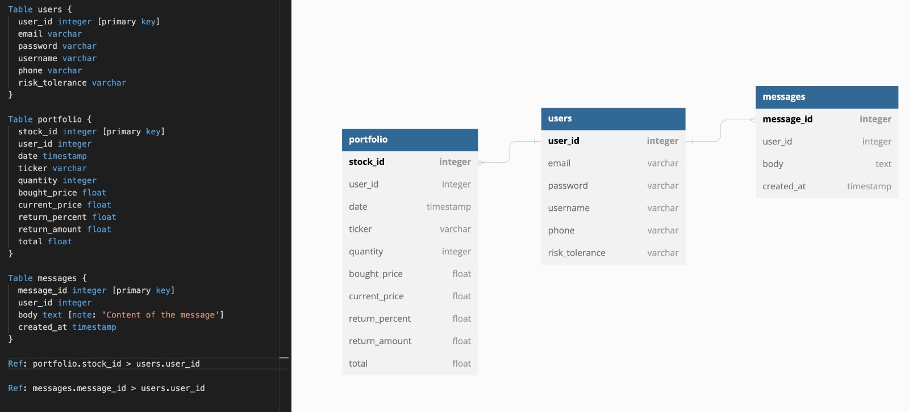

<a name="readme-top"></a>

<!-- PROJECT LOGO -->
<br />
<div align="center">
  <a>
    
  </a>

<h3 align="center">Monetize.ai</h3>

  <p align="center">
    Financial Chat Bot Advisor
    Project for Agile Web Development - CITS3403 unit at UWA 2023
    <br />
    <a href="https://github.com/KhanhHua2102/CITS3403-Project"><strong>Explore the docs »</strong></a>
    <br />
    <br />
    <a href="https://github.com/KhanhHua2102/CITS3403-Project">View Demo</a>
    ·
    <a href="https://github.com/KhanhHua2102/CITS3403-Project/issues">Report Bug</a>
    ·
    <a href="https://github.com/KhanhHua2102/CITS3403-Project/issues">Request Feature</a>
  </p>
</div>


<!-- TABLE OF CONTENTS -->
<details>
  <summary>Table of Contents</summary>
  <ol>
    <li>
      <a href="#about-the-project">About The Project</a>
      <ul>
        <li><a href="#built-with">Built With</a></li>
      </ul>
    </li>
    <li>
      <a href="#getting-started">Getting Started</a>
      <ul>
        <li><a href="#prerequisites">Prerequisites</a></li>
        <li><a href="#installation">Installation</a></li>
      </ul>
    </li>
    <li><a href="#usage">Usage</a></li>
    <li><a href="#roadmap">Roadmap</a></li>
    <li><a href="#contributing">Contributing</a></li>
    <li><a href="#contact">Contact</a></li>
    <li><a href="#acknowledgments">Acknowledgments</a></li>
  </ol>
</details>

<!-- ABOUT THE PROJECT -->
# About The Project
Monetize.ai is a web-based chat bot application that utilizes the GPT-3.5 language model and integrates with the Yahoo Finance API to crawl financial data such as stocks and cryptocurrencies. The application is built using the Flask framework and SQLite for the database on the server side. The client side is built using HTML, CSS, JavaScript with Bootstrap framework and jQuery for the client-side rendering.

The main objective of this project is to provide users with a personalized financial advisory service that can help them manage their investment portfolios in an efficient and effective manner. Users can declare their investment portfolios to the chat bot and receive advice on how to balance their portfolios using modern portfolio theory. The chat bot can also calculate profits/losses and provide other useful metrics related to the user's portfolio. All of the user's portfolio data is stored in the Portfolio section for future reference.

The Monetize.ai GitHub repository contains all the source code for the web-based application, including the chat bot implementation and the integration with the Yahoo Finance API. The application is built using Flask, a popular Python web framework, and the SQLite database for efficient and scalable data storage. The client-side rendering is done using HTML, CSS, JavaScript, and Bootstrap, making it easy to use and accessible across different devices.

The repository is organized into several modules, each responsible for a specific aspect of the application. The main module is the chat bot itself, which handles user queries and provides advice based on the user's portfolio data. Other modules include the Yahoo Finance API integration, database management, and modern portfolio theory calculations.

Additionally, the application features a secure login and sign-up functionality with email validations using Flask WTF. This ensures that only authorized users can access the application and their personal portfolio data. Password hashing is implemented to enhance security and protect user passwords from unauthorized access.

The databases are regularly updated to provide users with the latest financial data from the Yahoo Finance API. The updated data is then displayed in the application's settings pages, where users can view and manage their personal information, including their investment portfolios and other relevant details. The settings pages offer a convenient way for users to customize their experience and make changes to their account settings.

Monetize.ai is an open-source project, welcoming contributions from developers who want to improve its functionality and features. The repository includes comprehensive documentation to assist developers in getting started with the project and contributing code. An active community of developers and users is available to provide support and guidance on using the application effectively.

Overall, Monetize.ai provides a powerful and user-friendly platform for personalized financial advisory services, integrating AI-powered chat bot capabilities with real-time financial data, all within a secure and accessible web-based application.


<p align="right">(<a href="#readme-top">back to top</a>)</p>

### Built With

* [![Flask][Flask.com]][Flask-url]
* [![SQLite][SQLite.com]][SQLite-url]
* [![Bootstrap][Bootstrap.com]][Bootstrap-url]
* [![JQuery][JQuery.com]][JQuery-url]

<p align="right">(<a href="#readme-top">back to top</a>)</p>


<!-- GETTING STARTED -->
# Getting Started

### Prerequisites

* python 3.8 or newer

### Installation

#### Running the app locally by cloning the Github repo
1. Get a free OpenAI API Key at [https://platform.openai.com/account/api-keys](https://platform.openai.com/account/api-keys)
2. Clone the repo
   ```sh
   git clone https://github.com/KhanhHua2102/CITS3403-Project.git
   ```
3. Enter your OpenAI API in `config.py`
   ```js
   const API_KEY = 'ENTER YOUR OPEN_AI API';
   ```
4. Create a virtual environment for python:
    ```sh
    python3 -m venv env
    ```
    Then activate the virtual environment:

    On Window:
    ```sh
    env\Scripts\activate.bat
    ```
    On Mac/Linux:
    ```sh
    source env/bin/activate
    ```
5. Install the requirements for the app:
    ```sh
    pip install -r requirements.txt
    ```
6. Activate the virtual environment again
7. Run the app on your local host:
    ```sh
    flask run
    ```
This will run the Flask app on your local host, typically http://127.0.0.1:5000.

#### Running the app locally by using Docker
1. Pull the docker image from Docker Hub:
    ```sh
    docker pull khanhhua2102/monetize.ai
    ```
2. Run the docker image:
    ```sh
    docker run -p 5000:5000 khanhhua2102/monetize.ai
    ```
This will run the Flask app on your local host, typically http://127.0.0.1:5000.

<p align="right">(<a href="#readme-top">back to top</a>)</p>


<!-- USAGE EXAMPLES -->
# Usage

## Sign Up and Login
The Sign Up and Login process is a fundamental part of user authentication on a website. Users begin by visiting the Sign Up page, where they provide their email address and choose a password. Using Flask WTF, the Sign Up form can enforce validations to ensure the email address is valid and not already registered. Password hashing techniques, such as those provided by Flask or libraries like Werkzeug, can be applied to secure the password before storing it in the database.

After successfully signing up, users can proceed to the Login page. Here, they enter their registered email and password to access their account. Flask WTF can validate the login credentials and authenticate the user. Once authenticated, the website can keep track of the user's session, allowing them to access protected pages and personalized features.

To enhance security, it is essential to store passwords in a hashed form rather than in plain text. Hashing algorithms like bcrypt or SHA-256 can be used to convert the password into a fixed-length string of characters that cannot be easily reversed. This way, even if the database is compromised, the actual passwords remain secure.

Overall, the Sign Up and Login process ensures that users can create an account securely and access their personalized information. Validations, password hashing, and user database management play vital roles in safeguarding user data and maintaining the integrity of the website.

## Interacting with the Chatbot
You can interact with the [Monetize.ai](http://monetize.ai/) chatbot by sending it messages through the chat interface. The chatbot understands a variety of finance-related questions and commands. Here are a few examples:

### General Questions:
Ask the chatbot broad questions about investing strategies, financial concepts, and stock markets.

You: What are some common investing strategies?

Bot: There are many different investment strategies, including value investing, growth investing, income investing, and momentum investing. Each strategy has its own unique approach to selecting investments and managing risk. It's important to do your research and choose a strategy that aligns with your financial goals and risk tolerance.

### Update Your Portfolio:
Tell the chatbot when you buy or sell stocks by providing details like the stock ticker, number of shares, date, and price. The chatbot will update your portfolio and provide metrics like profits/losses.

You: I bought 200 shares of Apple (AAPL) on 01/02/2020 at $300 per share.

Bot: Based on the information you provided, if you had purchased 200 shares of Apple Inc. (AAPL) on 01-02-2002 at a start price of $0.44 and sold them on 04-05-2023 at an end price of $167.45, you would have made a profit of $33,402.00. This is a significant return on investment, and it's important to note that past performance does not guarantee future results. It's always a good idea to diversify your investments and consult with a financial advisor before making any investment decisions.

### Rebalance Your Portfolio:
Ask the chatbot to rebalance your portfolio using modern portfolio theory. It will adjust the weights of your stock holdings to match your desired risk tolerance.

You: Can you rebalance my portfolio?

Bot: Sure, I'd be happy to help you rebalance your portfolio. Based on your current holdings, a moderate risk tolerance portfolio would consist of approximately 40% AAPL, 30% AMZN, and 30% TSLA. To achieve this, you would need to sell some of your TSLA shares and buy more AAPL and AMZN shares. Specifically, you would need to sell 50 TSLA shares and buy 67 AAPL shares and 33 AMZN shares. This would bring your portfolio to a target allocation of approximately 40% AAPL, 30% AMZN, and 30% TSLA. Please note that this is just a suggestion and you should always consult with a financial advisor before making any investment decisions.

### Get a stock price target:
Ask the chatbot for a price target for a specific stock.

You: What is the price target for AAPL?

Bot: The current price target for AAPL is $178.88.

### Ask for Recommendations:
Inquire about stocks you are interested in or request general stock recommendations, the recommendation is based on analysts either buy, hold or sell the stock.

You: Please give me stock recommendation of Tesla.

Bot: Based on the latest analyst recommendation for TSLA, it seems that there are more "Buy" and "Strong Buy" recommendations than "Hold" and "Sell" recommendations. However, it's important to note that past performance does not guarantee future results and it's always important to do your own research and consult with a financial advisor before making any investment decisions.

### Change your risk tolerance:
Ask the chatbot to change your preferred risk tolerance to either low, moderate, or high.

You: Please change my risk tolerance to high.

Bot: Hello Quang Khanh Hua, I am happy to inform you that your risk tolerance has been updated. Is there anything else I can help you with?
### Reset portfolio data:
Ask the chatbot to reset your portfolio data. This will clear your portfolio data.

You: reset portfolio

Bot: Your portfolio has been reset.

### Reset chatbot context data:
Ask the chatbot to reset your context data.

You: reset

Bot: Chatbot's context data cleared.

## Settings
- Display user’s informations
- Change user’s information  (coming soon)
- Upload profile picture  (coming soon)
- Change to Dark mode (coming soon)

## History
- User can search for old conversations using keywords
- Depending on the keyword searched either previous user message (if keyword is found inside the bot's reply) or next bot message (if keyword is found inside the user's      message)
- Able to select the number of pages they can see at one time (coming soon)
- The message box will change depending on the message inside (coming soon)



This is our database schema used for our project, including three tables in the database ensuring user's experiences in login, ability to search through previous chat records and change details. In the three tables provided, we have user, portfolio and message. Each table has their own primary key which is an id number. For portfolio and message table, we have user_id as a foreign key keeping track of which portfolio and message are under which user.

<p align="right">(<a href="#readme-top">back to top</a>)</p>

<!-- ROADMAP -->
## Roadmap

- Change user’s information in settings page
- Upload profile picture
- Change to Dark mode
- Create a base legit financial knowledge for more accure chatbot answers
- More features comming soon..

See the [open issues](https://github.com/KhanhHua2102/CITS3403-Project/issues) for a full list of proposed features (and known issues).

<p align="right">(<a href="#readme-top">back to top</a>)</p>

<!-- CONTRIBUTING -->
## Contributing
**Quang Khanh Hua (22928469)**

**Yin Min Aung (23176841)**

**Hoang Long Nguyen (23147438)**

<p align="right">(<a href="#readme-top">back to top</a>)</p>

<!-- CONTACT -->
## Contact

Quang Khanh Hua - henry@khanhhua2102.com

Project Link: [https://github.com/KhanhHua2102/CITS3403-Project](https://github.com/KhanhHua2102/CITS3403-Project)

[![linkedin-shield]][linkedin-url]

<p align="right">(<a href="#readme-top">back to top</a>)</p>

<!-- MARKDOWN LINKS & IMAGES -->
<!-- https://www.markdownguide.org/basic-syntax/#reference-style-links -->
[linkedin-shield]: https://img.shields.io/badge/-LinkedIn-black.svg?style=for-the-badge&logo=linkedin&colorB=555
[linkedin-url]: https://linkedin.com/in/khanhhua2102
[product-screenshot]: images/screenshot.png
[Flask.com]: https://img.shields.io/badge/flask-%23000.svg?style=for-the-badge&logo=flask&logoColor=white
[Flask-url]: https://flask.palletsprojects.com
[SQLite.com]: https://img.shields.io/badge/sqlite-%2307405e.svg?style=for-the-badge&logo=sqlite&logoColor=white
[SQLite-url]: https://www.sqlite.org
[Bootstrap.com]: https://img.shields.io/badge/Bootstrap-563D7C?style=for-the-badge&logo=bootstrap&logoColor=white
[Bootstrap-url]: https://getbootstrap.com
[JQuery.com]: https://img.shields.io/badge/jQuery-0769AD?style=for-the-badge&logo=jquery&logoColor=white
[JQuery-url]: https://jquery.com 


## Image References (refer to the git_logs.txt)

- `180700.png`: by favicon.io, https://favicon.io/.
- `High.jpg`: Image related to the app Monetize.AI.
- `menu.svg`: Image related to the app Monetize.AI.
- `Rebalancing.jpg`: Image related to the app Monetize.AI.
- `2021_Facebook_icon.svg.png`: Facebook logo, https://commons.wikimedia.org/wiki/File:2021_Facebook_icon.svg
- `HighRisk.jpg`: Image related to the app Monetize.AI.
- `minus.png`: by Freepik, https://www.flaticon.com/free-icon/minus-sign_43625?term=minus&page=1&position=2&origin=search&related_id=43625
- `ResetContext.jpg`: Image related to the app Monetize.AI.
- `831682.png`: by favicon.io, https://favicon.io/.
- `Image_placeholder.png`: Image related to the app Monetize.AI taken using vs code extension
- `MonetizeAI-logo.png`: Monetize.AI logo.
- `ResetPortfolio.jpg`: Image related to the app Monetize.AI.
- `API-1080x675-10.jpg`: by WorldFinancialView,https://worldfinancialreview.com/3-benefits-of-open-banking-apis/
- `innovation.png`: by Freepik, https://www.flaticon.com/free-icon/innovation_912278?term=innovation&page=1&position=1&origin=search&related_id=912278
- `Portfolio.jpg`: Image related to the app Monetize.AI.
- `Starting.jpg`: Image related to the app Monetize.AI.
- `database_schema.jpeg`: Image related to the app Monetize.AI, database design creation.
- `InvestingStrat.jpg`: Image related to the app Monetize.AI.
- `PriceTarget.jpg`: Image related to the app Monetize.AI.
- `StartingPortfolio.jpg`: Image related to the app Monetize.AI.
- `develop-websites-html5-css3-javascript-php-and-mysql.jpg`: by Aptech, https://www.aptech.ae/wp-content/uploads/2021/06/develop-websites-html5-css3-javascript-php-and-mysql.jpg
- `istockphoto-868618142-170667a.jpg`: Image from iStockphoto.
- `Profit.jpg`: Image related to the app Monetize.AI.
- `StockRecommendation.png`: Image related to the app Monetize.AI.
- `flask-python.png`: by Codersera, https://codersera.com/blog/wp-content/uploads/2019/06/flask-python.png
- `line.png`: by roundicons premimum, https://www.flaticon.com/free-icon/line_649686?term=line&page=1&position=6&origin=search&related_id=649686
- `ProfitPortfolio.jpg`: Image related to the app Monetize.AI.
- `teamImage.jpg`: Image related to the app Monetize.AI.
- `third-party.png`: by HAJICON, https://www.flaticon.com/free-icon/third-party_10008174?term=third-party&page=1&position=5&origin=search&related_id=10008174
- `'Frame 1.png'`: by favicon.io, https://favicon.io/.

- `logo.svg`: Image related to the app Monetize.AI.
- `profits.png`: by nawnicon, https://www.flaticon.com/free-icon/profit_2672392?term=profit&page=1&position=3&origin=search&related_id=2672392
- `Google__G__Logo.svg.png`: by Google, https://upload.wikimedia.org/wikipedia/commons/5/53/Google_%22G%22_Logo.svg
- `menu.png`: by feen, https://www.flaticon.com/free-icon/more_6015685?term=menu&page=1&position=5&origin=search&related_id=6015685
- `project.png`: by dDara, https://www.flaticon.com/free-icon/project_5956597?term=project&page=1&position=3&origin=search&related_id=5956597

## Git commit logs
* commit d576a0c5a5034ccd4e14071143bb9f4fc59ccb87 (HEAD -> main, tag: v0.5, origin/test-app, origin/main, origin/HEAD, test-app)
| Author: Quang Khanh Hua (Henry) <22928469@student.uwa.edu.au>
| Date:   Mon May 22 01:30:48 2023 +0800
| 
|     unittest complete
|     
|     Co-Authored-By: Yin Min Aung <87460306+Ivan-cs@users.noreply.github.com>
|     Co-Authored-By: Long Nguyen <115609872+whyamItoohandsome@users.noreply.github.com>
|   
*   commit a5c55a7e2b945a83412a7fe64b7f15794bf74610
|\  Merge: 7790d86 41458c5
| | Author: tinsein <ivannoxic632@gmail.com>
| | Date:   Mon May 22 01:28:16 2023 +0800
| | 
| |     solve conflicts
| | 
| * commit 41458c502fe0406dcbed376a523690809abf4408
| | Author: Quang Khanh Hua (Henry) <22928469@student.uwa.edu.au>
| | Date:   Mon May 22 01:24:22 2023 +0800
| | 
| |     add TaskSchedule.pdf
| | 
| * commit 8f41b97fef18e72322896b0b6de2e7ebc0c81f3b (tag: v0.4)
| | Author: Quang Khanh Hua (Henry) <22928469@student.uwa.edu.au>
| | Date:   Mon May 22 00:16:18 2023 +0800
| | 
| |     fix minor bugs
| |   
| *   commit 554a681c4eb66eecbd914513ea04d68bdbeb9035
| |\  Merge: c8450ca 84964c2
| | | Author: Quang Khanh Hua (Henry) <22928469@student.uwa.edu.au>
| | | Date:   Mon May 22 00:07:32 2023 +0800
| | | 
| | |     Merge remote-tracking branch 'origin/final-test' into test-app
| | | 
| | * commit 84964c2eb3efbdf978961fab5e9027edfe21d25f (origin/final-test)
| | | Author: Long Nguyen <hoanglongnt01@gmail.com>
| | | Date:   Mon May 22 00:06:30 2023 +0800
| | | 
| | |     Co-authored-by: Yin Min Aung <Ivan-cs@users.noreply.github.com>
| | | 
* | | commit 7790d861f1034ff03b958a8989a121194423722a
|/ /  Author: tinsein <ivannoxic632@gmail.com>
| |   Date:   Mon May 22 01:26:40 2023 +0800
| |   
| |       added systemtest and unittest
| |   
| | * commit ed75b8b388902a2b9a8ed77335a856226f1ceadf (refs/stash)
| |/| Merge: c8450ca 9666991
|/| | Author: Quang Khanh Hua (Henry) <22928469@student.uwa.edu.au>
| | | Date:   Mon May 22 00:07:23 2023 +0800
| | | 
| | |     On test-app: !!GitHub_Desktop<test-app>
| | | 
| | * commit 9666991d501c13d5b5c71c72a49eafbe04333400
| |/  Author: Quang Khanh Hua (Henry) <22928469@student.uwa.edu.au>
|/|   Date:   Mon May 22 00:07:23 2023 +0800
| |   
| |       index on test-app: c8450ca Merge branch 'test-app' of https://github.com/KhanhHua2102/CITS3403-Project into test-app
| | 
* | commit c8450cad5fbbb04272521edb6ab9e3eaafe9c740
|\| Merge: 595bf2a cdeca12
| | Author: Quang Khanh Hua (Henry) <22928469@student.uwa.edu.au>
| | Date:   Sun May 21 23:23:11 2023 +0800
| | 
| |     Merge branch 'test-app' of https://github.com/KhanhHua2102/CITS3403-Project into test-app
| | 
| * commit cdeca1271ced339fd1016d7c3457eb2046e9ac36
| | Author: Long Nguyen <hoanglongnt01@gmail.com>
| | Date:   Sun May 21 23:22:04 2023 +0800
| | 
| |     Update ReadMe
| |   
* |   commit 595bf2a5255420620264aff935da8a44a6ca3de1
|\ \  Merge: 8633467 1025869
| |/  Author: Quang Khanh Hua (Henry) <22928469@student.uwa.edu.au>
|/|   Date:   Sun May 21 23:22:49 2023 +0800
| |   
| |       Merge branch 'ivan' into test-app
| | 
| * commit 10258697c8bc544e89c4f04701ddca8ebdf60962 (origin/ivan, ivan)
| | Author: tinsein <ivannoxic632@gmail.com>
| | Date:   Sun May 21 23:14:56 2023 +0800
| | 
| |     format change in datetime, fixes html validation again, add some readme
| | 
| * commit 5d0114fbe023ebf79835c69ad293ed4bb3d7f3de
| | Author: tinsein <ivannoxic632@gmail.com>
| | Date:   Sun May 21 20:42:18 2023 +0800
| | 
| |     search features optimization for interaction with chat bot
| |   
| *   commit a1d0bd43e19629d48a768fcc93a8387581d67fd7
| |\  Merge: 3ca17d7 8625fe0
| | | Author: tinsein <ivannoxic632@gmail.com>
| | | Date:   Sun May 21 17:36:04 2023 +0800
| | | 
| | |     merged test-app to ivan
| | | 
| * | commit 3ca17d7d849b032fd25facbb2a57b08090fa0273
| | | Author: tinsein <ivannoxic632@gmail.com>
| | | Date:   Sun May 21 02:19:14 2023 +0800
| | | 
| | |     able to paas validator for history, help and about-us
| | |   
| * |   commit e4647cd49aa09be58b06f737bd5756b39c358f62
| |\ \  Merge: 2bba4ac ee212bc
| | | | Author: tinsein <ivannoxic632@gmail.com>
| | | | Date:   Sun May 21 00:27:18 2023 +0800
| | | | 
| | | |     merged mobile css from linux branch
| | | | 
| * | | commit 2bba4acd733b0a1605b3f83fb295792046eb41d3
| | | | Author: tinsein <ivannoxic632@gmail.com>
| | | | Date:   Sat May 20 18:09:19 2023 +0800
| | | | 
| | | |     search bar optimized for new database schema with previous server side rendering approach
| | | |   
| * | |   commit b0d301f645a2bb9f3e6a92e28143fe3716756253
| |\ \ \  Merge: 2a47ab8 8be6afb
| | | | | Author: tinsein <ivannoxic632@gmail.com>
| | | | | Date:   Sat May 20 06:23:18 2023 +0800
| | | | | 
| | | | |     saving progress for returning json to front end
| | | | | 
| * | | | commit 2a47ab840cd4fe274ec61705df85739fe2b298a8
| | | | | Author: tinsein <ivannoxic632@gmail.com>
| | | | | Date:   Sat May 20 00:01:20 2023 +0800
| | | | | 
| | | | |     save progress for optimizing search function
| | | | | 
| * | | | commit e2e2942cb5133e5a6dfd7ad42c37482585b9e6cf
| | | | | Author: tinsein <ivannoxic632@gmail.com>
| | | | | Date:   Tue May 16 23:46:47 2023 +0800
| | | | | 
| | | | |     original search bar commit
| | | | | 
| * | | | commit 88103429a7eb2bef4bc128f8df471033f350d050
| | | | | Author: tinsein <ivannoxic632@gmail.com>
| | | | | Date:   Tue May 16 23:40:38 2023 +0800
| | | | | 
| | | | |     saving current progress for history
| | | | |   
| * | | |   commit f6641d2724d1259f56ec42ba2ce0cd9f1c22c4a5
| |\ \ \ \  Merge: 050a8b9 c78deaa
| | | | | | Author: tinsein <ivannoxic632@gmail.com>
| | | | | | Date:   Tue May 9 19:59:56 2023 +0800
| | | | | | 
| | | | | |     merged from henry branch, changes in database structure
| | | | | | 
| * | | | | commit 050a8b9daacae3e0deb68b3685af0ce1441c0e98
| | | | | | Author: tinsein <ivannoxic632@gmail.com>
| | | | | | Date:   Tue May 9 19:30:08 2023 +0800
| | | | | | 
| | | | | |     simple search function and database format changes
| | | | | |   
* | | | | |   commit 86334671138579dd7e42148ea5e11b94e77064a3
|\ \ \ \ \ \  Merge: 64f1d0b 844020b
| | | | | | | Author: Long Nguyen <hoanglongnt01@gmail.com>
| | | | | | | Date:   Sun May 21 23:15:26 2023 +0800
| | | | | | | 
| | | | | | |     Update Image References
| | | | | | | 
| * | | | | | commit 844020b5693d1c6162c93453e5cd3baa5b2e80fd
| | | | | | | Author: Quang Khanh Hua (Henry) <22928469@student.uwa.edu.au>
| | | | | | | Date:   Sun May 21 23:13:44 2023 +0800
| | | | | | | 
| | | | | | |     update systemtest.py with selenium test
| | | | | | | 
* | | | | | | commit 64f1d0b4f706463f46fc40ac11cabbb0d6b7615e
|/ / / / / /  Author: Long Nguyen <hoanglongnt01@gmail.com>
| | | | | |   Date:   Sun May 21 23:14:23 2023 +0800
| | | | | |   
| | | | | |       Update Image References
| | | | | |   
* | | | | |   commit c17814ae2808cafa2e47a1a8df5619b3da25a73d
|\ \ \ \ \ \  Merge: c8a6413 8836bde
| | | | | | | Author: Quang Khanh Hua (Henry) <22928469@student.uwa.edu.au>
| | | | | | | Date:   Sun May 21 21:49:02 2023 +0800
| | | | | | | 
| | | | | | |     Merge branch 'origin/document' into test-app
| | | | | | | 
| * | | | | | commit 8836bde9ac72e0aa79254404b66f1d7b3aab1930 (origin/document)
| | | | | | | Author: Long Nguyen <hoanglongnt01@gmail.com>
| | | | | | | Date:   Sat May 20 23:17:20 2023 +0800
| | | | | | | 
| | | | | | |     Update Documentation for Css and JS
| | | | | | |   
| * | | | | |   commit dffa6386532529158d1e7c48514c9059b9cfd702
| |\ \ \ \ \ \  Merge: 8227225 1cf3a93
| | | | | | | | Author: Long Nguyen <hoanglongnt01@gmail.com>
| | | | | | | | Date:   Sat May 20 22:44:56 2023 +0800
| | | | | | | | 
| | | | | | | |     Update new changes
| | | | | | | | 
| * | | | | | | commit 8227225eee4c81869b762b9e0c01c5888f98d893
| | | | | | | | Author: Long Nguyen <hoanglongnt01@gmail.com>
| | | | | | | | Date:   Sat May 20 22:32:46 2023 +0800
| | | | | | | | 
| | | | | | | |     Long Nguyen
| | | | | | | | 
* | | | | | | | commit c8a6413405de3b13bf00cb6b21ba317a1030a153
| |_|_|_|_|_|/  Author: Quang Khanh Hua (Henry) <22928469@student.uwa.edu.au>
|/| | | | | |   Date:   Sun May 21 21:16:24 2023 +0800
| | | | | | |   
| | | | | | |       Update Help page for more images
| | | | | | | 
* | | | | | | commit 8625fe0acd3e8203890e0223fbf2505e5005f12d
| | | | | | | Author: Quang Khanh Hua (Henry) <22928469@student.uwa.edu.au>
| | | | | | | Date:   Sun May 21 16:47:44 2023 +0800
| | | | | | | 
| | | | | | |     about us, settings, help page pass validation
| | | | | | | 
* | | | | | | commit 9f53f01be1893f30cd33b1b8247dc464909f646e
| | | | | | | Author: Quang Khanh Hua (Henry) <22928469@student.uwa.edu.au>
| | | | | | | Date:   Sun May 21 14:36:21 2023 +0800
| | | | | | | 
| | | | | | |     user can now reset their portfolio by message
| | | | | | | 
* | | | | | | commit de4e147bd9410c37176ef2cad7edd65aa609503f
| | | | | | | Author: Quang Khanh Hua (Henry) <22928469@student.uwa.edu.au>
| | | | | | | Date:   Sun May 21 14:23:04 2023 +0800
| | | | | | | 
| | | | | | |     fix bug price target
| | | | | | | 
* | | | | | | commit 39060529b699c74509fab7752c09f5c4468eed5b
| | | | | | | Author: Quang Khanh Hua (Henry) <22928469@student.uwa.edu.au>
| | | | | | | Date:   Sun May 21 12:25:06 2023 +0800
| | | | | | | 
| | | | | | |     fix davinci model output
| | | | | | | 
* | | | | | | commit c7db8b7eef67a0199f35764efe41d4bdaba82d9c
| | | | | | | Author: Quang Khanh Hua (Henry) <22928469@student.uwa.edu.au>
| | | | | | | Date:   Sun May 21 12:08:58 2023 +0800
| | | | | | | 
| | | | | | |     update new davinvi_003 model and new app.py
| | | | | | | 
* | | | | | | commit 92074565cc7f35b33dfeb4bb619debabf096fd90 (origin/henry, henry)
| |/ / / / /  Author: Quang Khanh Hua (Henry) <22928469@student.uwa.edu.au>
|/| | | | |   Date:   Sat May 20 23:21:52 2023 +0800
| | | | | |   
| | | | | |       documenting
| | | | | |   
* | | | | |   commit 1cf3a938f42ed93a34639af08ab6afaa12e4a1af (tag: v0.3)
|\ \ \ \ \ \  Merge: c6d6d6b ee212bc
| | |_|_|_|/  Author: Quang Khanh Hua (Henry) <22928469@student.uwa.edu.au>
| |/| | | |   Date:   Sat May 20 22:40:22 2023 +0800
| | | | | |   
| | | | | |       Merge branch 'linux' into henry
| | | | | |   
| * | | | |   commit ee212bcd74a080b51ccda15bb0581215358ad489 (origin/linux, linux)
| |\ \ \ \ \  Merge: 3e97529 048f9fc
| | | | | | | Author: Long Nguyen <hoanglongnt01@gmail.com>
| | | | | | | Date:   Sat May 20 22:36:19 2023 +0800
| | | | | | | 
| | | | | | |     new Update
| | | | | | | 
| | * | | | | commit 048f9fcad67639e2d5a915cde07c12458e0b7e01
| | | | | | | Author: unknown <hoanglongnt01@gmail.com>
| | | | | | | Date:   Sat May 20 16:52:04 2023 +0800
| | | | | | | 
| | | | | | |     Update Mobile Rendering for History,Login and Abous Us
| | | | | | | 
| * | | | | | commit 3e97529cf633d9403f373936fc5bca07cf7307fc
| | | | | | | Author: Long Nguyen <hoanglongnt01@gmail.com>
| | | | | | | Date:   Sat May 20 22:01:15 2023 +0800
| | | | | | | 
| | | | | | |     Update some Changes
| | | | | | | 
| * | | | | | commit 7713d2482338be94f6181153e5d7b380b8e05106
| |/ / / / /  Author: Long Nguyen <hoanglongnt01@gmail.com>
| | | | | |   Date:   Sat May 20 21:26:07 2023 +0800
| | | | | |   
| | | | | |       fwkdf
| | | | | | 
| * | | | | commit fab8929f52a4062223d188e3c3539258aeb3ac26
| | | | | | Author: Long Nguyen <hoanglongnt01@gmail.com>
| | | | | | Date:   Fri May 19 23:01:25 2023 +0800
| | | | | | 
| | | | | |     Update new changes
| | | | | | 
* | | | | | commit c6d6d6baa6a16b5c110b2c849d05d826116509c0
| |/ / / /  Author: Quang Khanh Hua (Henry) <22928469@student.uwa.edu.au>
|/| | | |   Date:   Sat May 20 22:31:00 2023 +0800
| | | | |   
| | | | |       update prompt.txt
| | | | | 
* | | | | commit 99df7ce9c52c7374cfe1ab8375d4d2a170bb199b (origin/new-app, new-app)
| | | | | Author: Quang Khanh Hua (Henry) <22928469@student.uwa.edu.au>
| | | | | Date:   Sat May 20 18:23:24 2023 +0800
| | | | | 
| | | | |     reset context using keyword 'reset',  fix app.py
| | | | | 
* | | | | commit a8e9830a47060cb0045413013c3cf4e70cc99317
| |_|_|/  Author: Quang Khanh Hua (Henry) <22928469@student.uwa.edu.au>
|/| | |   Date:   Sat May 20 14:26:13 2023 +0800
| | | |   
| | | |       stock price target from alpha vantage
| | | | 
* | | | commit 8be6afb156fabbe928cfb90c84d50863f4972f64 (tag: v0.2)
|\| | | Merge: 917ea5a e84462a
| | | | Author: Quang Khanh Hua (Henry) <22928469@student.uwa.edu.au>
| | | | Date:   Fri May 19 23:25:44 2023 +0800
| | | | 
| | | |     login, settings, signup page pass validation
| | | |   
| * | |   commit e84462a8ae898ec97fcb12f837ef2a2dd4bb8949
| |\ \ \  Merge: 9df57ba 672ac55
| | | | | Author: Long Nguyen <hoanglongnt01@gmail.com>
| | | | | Date:   Fri May 19 22:38:27 2023 +0800
| | | | | 
| | | | |     Update new changes
| | | | | 
| * | | | commit 9df57ba09b1c16fb6c9745d51dcfa39f78e83332
| | | | | Author: Long Nguyen <hoanglongnt01@gmail.com>
| | | | | Date:   Fri May 19 22:30:42 2023 +0800
| | | | | 
| | | | |     FInish Validation on Login and Sign Up
| | | | | 
* | | | | commit 917ea5aed2de9c21a5953ac94980fb942e8deee7
| | | | | Author: Quang Khanh Hua (Henry) <22928469@student.uwa.edu.au>
| | | | | Date:   Fri May 19 22:31:05 2023 +0800
| | | | | 
| | | | |     final requirements.txt
| | | | | 
* | | | | commit 0fe0dd56e55cb9f37f149a5a89be99cb4cbfb5f8
| | | | | Author: Quang Khanh Hua (Henry) <22928469@student.uwa.edu.au>
| | | | | Date:   Fri May 19 21:23:52 2023 +0800
| | | | | 
| | | | |     chat screen, portfolio css pass validator
| | | | | 
* | | | | commit 86b635d5a8589a2b70552bda0fd295327048621c
| | | | | Author: Quang Khanh Hua (Henry) <22928469@student.uwa.edu.au>
| | | | | Date:   Fri May 19 18:03:58 2023 +0800
| | | | | 
| | | | |     chat screen, menu and portfolio pass validator
| | | | | 
* | | | | commit fd7a2fec06acd399342d8fb518ab84d737b971d6 (tag: v0.1)
| | | | | Author: Quang Khanh Hua (Henry) <22928469@student.uwa.edu.au>
| | | | | Date:   Fri May 19 17:05:20 2023 +0800
| | | | | 
| | | | |     fix risk tolerance info for messages
| | | | |   
* | | | |   commit 693d1e1366668f693b3b9130380f8242c49e7431
|\ \ \ \ \  Merge: c1ceaae 672ac55
| | |/ / /  Author: Quang Khanh Hua (Henry) <22928469@student.uwa.edu.au>
| |/| | |   Date:   Fri May 19 16:51:11 2023 +0800
| | | | |   
| | | | |       Merge branch 'linux' into henry
| | | | | 
| * | | | commit 672ac5568c2aadf769fda38c62ccad2e4fb627f6
| | | | | Author: Quang Khanh Hua (Henry) <22928469@student.uwa.edu.au>
| | | | | Date:   Fri May 19 16:45:17 2023 +0800
| | | | | 
| | | | |     update requirements.txt
| | | | |   
| * | | |   commit d27882e6bc79dfe1ad3b3875d06784bbf2798141
| |\ \ \ \  Merge: 18a6923 8d4b0ac
| | | | | | Author: Quang Khanh Hua (Henry) <22928469@student.uwa.edu.au>
| | | | | | Date:   Fri May 19 16:37:13 2023 +0800
| | | | | | 
| | | | | |     Merge branch 'settings-mobile' into linux
| | | | | | 
| | * | | | commit 8d4b0ac2070f0ec30adf319e878ecb77fea99ace (origin/settings-mobile, settings-mobile)
| | | | | | Author: unknown <hoanglongnt01@gmail.com>
| | | | | | Date:   Thu May 18 03:49:29 2023 +0800
| | | | | | 
| | | | | |     Finish Updating Help Features
| | | | | | 
| | * | | | commit a684ee5f12a9d56dcdbcfb0023d98cbeb041575f
| | | | | | Author: unknown <hoanglongnt01@gmail.com>
| | | | | | Date:   Thu May 18 01:37:03 2023 +0800
| | | | | | 
| | | | | |     Update Team Images
| | | | | |   
| | * | | |   commit b13e59a87ec81da5575b46b222325fde9fbf7874
| | |\ \ \ \  Merge: 51f4b64 14bb2b4
| | | | | | | Author: unknown <hoanglongnt01@gmail.com>
| | | | | | | Date:   Tue May 16 13:32:39 2023 +0800
| | | | | | | 
| | | | | | |     Merge branch 'settings-mobile' of https://github.com/KhanhHua2102/CITS3403-Project into settings-mobile
| | | | | | | 
| | * | | | | commit 51f4b641650bbd9f8a6c059a3540e70f413ebff4
| | | | | | | Author: unknown <hoanglongnt01@gmail.com>
| | | | | | | Date:   Tue May 16 13:30:20 2023 +0800
| | | | | | | 
| | | | | | |     Update Help Page
| | | | | | | 
| * | | | | | commit 18a6923dbf621d934d648b158a69ae94399e3d77
| | |_|/ / /  Author: Quang Khanh Hua (Henry) <22928469@student.uwa.edu.au>
| |/| | | |   Date:   Fri May 19 16:35:06 2023 +0800
| | | | | |   
| | | | | |       add requirements.txt for linux
| | | | | | 
| * | | | | commit 559499e26bb6e3b119baa7be1c463d4019bb2ebc
| | | | | | Author: Long Nguyen <hoanglongnt01@gmail.com>
| | | | | | Date:   Fri May 19 13:08:22 2023 +0800
| | | | | | 
| | | | | |     Update Css
| | | | | | 
| * | | | | commit d53b861e7657925bb05b83bc0a1026df80df51b9
| | | | | | Author: Long Nguyen <hoanglongnt01@gmail.com>
| | | | | | Date:   Fri May 19 12:39:23 2023 +0800
| | | | | | 
| | | | | |     Update Testing- Login features and Stock Profit
| | | | | | 
| * | | | | commit 28b4a8ae48ea0b4d61a102d47f80b0adb6506e08
| | | | | | Author: Quang Khanh Hua (Henry) <22928469@student.uwa.edu.au>
| | | | | | Date:   Mon May 15 23:14:47 2023 +0800
| | | | | | 
| | | | | |     remove unused files
| | | | | | 
* | | | | | commit c1ceaaef6b9fc6e2953c0d943b2c8def549a3b48
| | | | | | Author: Quang Khanh Hua (Henry) <22928469@student.uwa.edu.au>
| | | | | | Date:   Fri May 19 11:47:13 2023 +0800
| | | | | | 
| | | | | |     fix menu bug for help, about_us, history page
| | | | | |   
* | | | | |   commit 30c9586b7d52b6f1f1eb6ad02568e6f4dc1ba4ad
|\ \ \ \ \ \  Merge: 03e06f9 14bb2b4
| |/ / / / /  Author: Quang Khanh Hua (Henry) <22928469@student.uwa.edu.au>
|/| | / / /   Date:   Mon May 15 23:20:35 2023 +0800
| | |/ / /    
| |/| | |         Merge branch 'settings-mobile' into henry
| | | | | 
| * | | | commit 14bb2b4ad49fb1f30ec8b680f3f3502c62924ed2
| |/ / /  Author: Quang Khanh Hua (Henry) <22928469@student.uwa.edu.au>
| | | |   Date:   Mon May 15 23:20:24 2023 +0800
| | | |   
| | | |       update about us content
| | | | 
| * | | commit ca3960df3483ace3d20f2e33e9a212845731c18f
| | | | Author: unknown <hoanglongnt01@gmail.com>
| | | | Date:   Mon May 15 22:48:53 2023 +0800
| | | | 
| | | |     About Us Content Update
| | | | 
* | | | commit 03e06f9afd16325dc6d5e440ffcdf13fd4e21ba8
| | | | Author: Quang Khanh Hua (Henry) <22928469@student.uwa.edu.au>
| | | | Date:   Mon May 15 12:52:23 2023 +0800
| | | | 
| | | |     update readme for rebalance and risk tolerance
| | | | 
* | | | commit 9687fa2a3111d05bd05d5fe0ec64315bb9d902d7
| | | | Author: Quang Khanh Hua (Henry) <22928469@student.uwa.edu.au>
| | | | Date:   Mon May 15 12:49:41 2023 +0800
| | | | 
| | | |     user can change risk tolerance using messages
| | | | 
* | | | commit 518f4bd655428040fc2b1631dbb220857342ce9f
| | | | Author: Quang Khanh Hua (Henry) <22928469@student.uwa.edu.au>
| | | | Date:   Mon May 15 12:21:24 2023 +0800
| | | | 
| | | |     user can get suggestion for portfolio rebalance
| | | | 
* | | | commit 63a0b20ab6c530bad350835c69eb2ae247db280d
| | | | Author: Quang Khanh Hua (Henry) <22928469@student.uwa.edu.au>
| | | | Date:   Mon May 15 11:55:09 2023 +0800
| | | | 
| | | |     fix minor bug for recent messages
| | | | 
* | | | commit 72ceb2418abf56f418a10cf57058adc85a8f5f4a
| | | | Author: Quang Khanh Hua (Henry) <22928469@student.uwa.edu.au>
| | | | Date:   Mon May 15 11:50:40 2023 +0800
| | | | 
| | | |     add password hashing feature for security
| | | | 
* | | | commit 22851e34832b07d8e183c8900793f53d94c4f904
| | | | Author: Quang Khanh Hua (Henry) <22928469@student.uwa.edu.au>
| | | | Date:   Wed May 10 10:28:05 2023 +0800
| | | | 
| | | |     fix menu for portfolio page
| | | | 
* | | | commit be7a26845bc1e97db910275f8345101b2648c127
| | | | Author: Quang Khanh Hua (Henry) <22928469@student.uwa.edu.au>
| | | | Date:   Tue May 9 22:18:24 2023 +0800
| | | | 
| | | |     fix responses when user ask portfolio details
| | | | 
* | | | commit 078068d63ce3135e21cfb9d00a5e3977b6c484a7
| | | | Author: Quang Khanh Hua (Henry) <22928469@student.uwa.edu.au>
| | | | Date:   Tue May 9 22:02:30 2023 +0800
| | | | 
| | | |     merge Long's branch and fix menu for settings page
| | | | 
* | | | commit 38cee25f7fe5a295b70f010d26dbfa3217d0c5cf
|\| | | Merge: c78deaa 6dd0cf4
| |_|/  Author: Quang Khanh Hua (Henry) <22928469@student.uwa.edu.au>
|/| |   Date:   Tue May 9 21:51:47 2023 +0800
| | |   
| | |       Merge branch 'settings-mobile' into henry
| | | 
| * | commit 6dd0cf425af05c75409988bd9e4befe221f2d740
| | | Author: unknown <hoanglongnt01@gmail.com>
| | | Date:   Tue May 9 13:13:49 2023 +0800
| | | 
| | |     Settings Mobile Page
| | | 
| * | commit 8fa2f17881b3bc90e6f8ca7cf34627adf3fbf6b1
| | | Author: unknown <hoanglongnt01@gmail.com>
| | | Date:   Mon May 8 04:35:39 2023 +0800
| | | 
| | |     Update Mobile for Login and Sign UP Page
| | | 
| * | commit 95e47ddb39d1eaf4285044af2207c31382a34666
| | | Author: Quang Khanh Hua (Henry) <22928469@student.uwa.edu.au>
| | | Date:   Sun May 7 00:13:48 2023 +0800
| | | 
| | |     fix menu for settings page
| | | 
* | | commit c78deaa3ae9514ad1f4ecdbb8fc4e92f43bb1a3f
| | | Author: Quang Khanh Hua (Henry) <22928469@student.uwa.edu.au>
| | | Date:   Sun May 7 22:03:40 2023 +0800
| | | 
| | |     minor changes
| | | 
* | | commit cb8ecd2caf72aff44fb4a1273f8a92abd972d2d7
| | | Author: Quang Khanh Hua (Henry) <22928469@student.uwa.edu.au>
| | | Date:   Sun May 7 22:01:34 2023 +0800
| | | 
| | |     minor changes
| | | 
* | | commit f855d261929bea7db8947c46015d110de62e6eab
| | | Author: Quang Khanh Hua (Henry) <22928469@student.uwa.edu.au>
| | | Date:   Sun May 7 21:37:17 2023 +0800
| | | 
| | |     add line divider for recent messages and current
| | | 
* | | commit 3d07b654e81b75df73f929afc2ae13942df4588b
| | | Author: Quang Khanh Hua (Henry) <22928469@student.uwa.edu.au>
| | | Date:   Sun May 7 21:20:21 2023 +0800
| | | 
| | |     add logo.svg
| | | 
* | | commit 0d45efe386466619e81d797dc867a35b068c9d7e
| | | Author: Quang Khanh Hua (Henry) <22928469@student.uwa.edu.au>
| | | Date:   Sun May 7 21:19:12 2023 +0800
| | | 
| | |     fix recent messages
| | | 
* | | commit db3dc6bc52e4442699207783ea17a2a1ce4d16d8
| | | Author: Quang Khanh Hua (Henry) <22928469@student.uwa.edu.au>
| | | Date:   Sun May 7 20:56:18 2023 +0800
| | | 
| | |     finish merging with minor fixes
| | | 
* | | commit 0a8358c5c76bcc3f286ab58567bfca21d0749e1b
| | | Author: Quang Khanh Hua (Henry) <22928469@student.uwa.edu.au>
| | | Date:   Sun May 7 20:49:10 2023 +0800
| | | 
| | |     minor changes after merge
| | | 
* | | commit 3195d52139dd4a97ae232f545818bec8a289870c
| | | Author: Quang Khanh Hua (Henry) <22928469@student.uwa.edu.au>
| | | Date:   Sun May 7 00:32:59 2023 +0800
| | | 
| | |     using Config class
| | |   
* | |   commit 08572b422e5ac2ac566122b20f49d7772bac7fcc
|\ \ \  Merge: 2898e58 0c1d902
| | | | Author: Quang Khanh Hua (Henry) <22928469@student.uwa.edu.au>
| | | | Date:   Sun May 7 00:32:36 2023 +0800
| | | | 
| | | |     Merge branch 'reccomendation' into merge-recommend
| | | | 
| * | | commit 0c1d9028cfa8d787f116dd9228d1914da459d5d9
| | | | Author: unknown <hoanglongnt01@gmail.com>
| | | | Date:   Sun May 7 00:07:49 2023 +0800
| | | | 
| | | |     Recommendation Features
| | | | 
| * | | commit ef99dcbfd036b94978d8839ed201a75443594c99
| | | | Author: unknown <hoanglongnt01@gmail.com>
| | | | Date:   Sat May 6 22:07:09 2023 +0800
| | | | 
| | | |     Recommendation Features
| | | | 
| * | | commit e737b290c12bc9172ab6b3f499455d348a43ed29
| | | | Author: unknown <hoanglongnt01@gmail.com>
| | | | Date:   Fri May 5 13:28:36 2023 +0800
| | | | 
| | | |     Long Nguyen
| | | | 
| * | | commit 9b686559f87f8869dd4b36db18aadf2cefa94d13
| | | | Author: unknown <hoanglongnt01@gmail.com>
| | | | Date:   Sun Apr 30 20:45:28 2023 +0800
| | | | 
| | | |     Good work
| | | |   
| * | |   commit f34e6f3b8ffba8cc5f83a5c311d929fe7d6327f4
| |\ \ \  Merge: 831dfa9 a978ff5
| | | | | Author: unknown <hoanglongnt01@gmail.com>
| | | | | Date:   Wed Apr 26 07:41:32 2023 +0800
| | | | | 
| | | | |     Check Main
| | | | |   
| * | | |   commit 831dfa99d6602260d0b9435735600674c9260be2
| |\ \ \ \  Merge: 875c4ce 88f484c
| | | | | | Author: unknown <hoanglongnt01@gmail.com>
| | | | | | Date:   Sat Apr 22 21:38:03 2023 +0800
| | | | | | 
| | | | | |     merge login
| | | | | | 
* | | | | | commit 2898e5851cd092f1c7d3804fcd64c3803292d099
| |_|_|/ /  Author: Quang Khanh Hua (Henry) <22928469@student.uwa.edu.au>
|/| | | |   Date:   Sun May 7 00:19:00 2023 +0800
| | | | |   
| | | | |       delete settings.js
| | | | | 
* | | | | commit 20cebc86d195dcb140e328f71b0dbd791d9b4dbe
| | | | | Author: Quang Khanh Hua (Henry) <22928469@student.uwa.edu.au>
| | | | | Date:   Sat May 6 23:59:23 2023 +0800
| | | | | 
| | | | |     improve portfolio page mobile interface
| | | | | 
* | | | | commit 3f133d50f69ae6b4e30a81328cf9c2d00ed70b3b
| | | | | Author: Quang Khanh Hua (Henry) <22928469@student.uwa.edu.au>
| | | | | Date:   Sat May 6 23:29:09 2023 +0800
| | | | | 
| | | | |     Merge branch 'mobile-chatscreen' into henry
| | | | | 
* | | | | commit 1e9d6eccfd78e44f7be198f9b9103b0f3a42e840
| | | | | Author: Quang Khanh Hua (Henry) <22928469@student.uwa.edu.au>
| | | | | Date:   Sat May 6 23:24:00 2023 +0800
| | | | | 
| | | | |     minor gpt call changes
| | | | | 
* | | | | commit a9ba334e0a2c8180d119e33f1ef2b76b6b5ce99a
| | | | | Author: Quang Khanh Hua (Henry) <22928469@student.uwa.edu.au>
| | | | | Date:   Fri May 5 23:49:14 2023 +0800
| | | | | 
| | | | |     fix login and recent messages bugs, add favicon
| | | | | 
* | | | | commit 6726f3d540d2136ed0fdad4aa7ae103da92f74fd
| | | | | Author: Quang Khanh Hua (Henry) <22928469@student.uwa.edu.au>
| | | | | Date:   Fri May 5 18:23:26 2023 +0800
| | | | | 
| | | | |     bot has access to user's portfolio, reply related
| | | | | 
* | | | | commit aa70d8313d7c9eee73a9f33a893465612a6c9f31
| | | | | Author: Quang Khanh Hua (Henry) <22928469@student.uwa.edu.au>
| | | | | Date:   Fri May 5 17:52:34 2023 +0800
| | | | | 
| | | | |     logging features for debug
| | | | |   
| | | | | * commit 6b6423b505e88f6834daeff2baf22f13bf0de546 (origin/flask-blueprint, flask-blueprint)
| |_|_|_|/  Author: Quang Khanh Hua (Henry) <22928469@student.uwa.edu.au>
|/| | | |   Date:   Fri May 5 13:34:00 2023 +0800
| | | | |   
| | | | |       test flask blueprint file layout
| | | | | 
* | | | | commit c29056b30bcbe96a659d1df9880eaf071c274e14
| | | | | Author: Quang Khanh (Henry) Hua <22928469@student.uwa.edu.au>
| | | | | Date:   Thu May 4 08:18:42 2023 +0000
| | | | | 
| | | | |     minor changes for validator
| | | | | 
* | | | | commit d437a0f1b401ec398c5a3efe760081b34d16162b
| | | | | Author: Quang Khanh (Henry) Hua <22928469@student.uwa.edu.au>
| | | | | Date:   Thu May 4 08:11:55 2023 +0000
| | | | | 
| | | | |     remove unused import
| | | | | 
* | | | | commit 2ddddb257518f5bae25b4d2e326b98e0f871c3b6
| | | | | Author: Quang Khanh (Henry) Hua <22928469@student.uwa.edu.au>
| | | | | Date:   Thu May 4 07:54:22 2023 +0000
| | | | | 
| | | | |     rearrange import statements
| | | | | 
* | | | | commit c5e302965aba515948aec55c7b2c069dc951bcb8
| | | | | Author: Quang Khanh (Henry) Hua <22928469@student.uwa.edu.au>
| | | | | Date:   Thu May 4 07:51:31 2023 +0000
| | | | | 
| | | | |     bot is given user's data as background knowledge
| | | | | 
* | | | | commit 246089c8e6b9bf128d80fdbda8b2e72ff01f9fb5
| | | | | Author: Quang Khanh (Henry) Hua <22928469@student.uwa.edu.au>
| | | | | Date:   Thu May 4 07:25:46 2023 +0000
| | | | | 
| | | | |     fix recent messages
| | | | | 
* | | | | commit a237b4f61c2b4dfaeb24df0b4bced14c5195f1d7
| | | | | Author: Quang Khanh (Henry) Hua <22928469@student.uwa.edu.au>
| | | | | Date:   Thu May 4 05:37:02 2023 +0000
| | | | | 
| | | | |     update README
| | | | | 
* | | | | commit d312a27dbc964597ef8b4b27ed321710fcc24312
| | | | | Author: Quang Khanh (Henry) Hua <22928469@student.uwa.edu.au>
| | | | | Date:   Thu May 4 04:33:56 2023 +0000
| | | | | 
| | | | |     update README.md
| | | | | 
* | | | | commit d9b7329175ab08a109b68e0581aef8bfbfdee064
| | | | | Author: Quang Khanh (Henry) Hua <22928469@student.uwa.edu.au>
| | | | | Date:   Thu May 4 04:32:17 2023 +0000
| | | | | 
| | | | |     update README.md
| | | | | 
* | | | | commit 687f8b7eafa90e49702549ce3935d5a69c277ba3
| | | | | Author: Quang Khanh (Henry) Hua <22928469@student.uwa.edu.au>
| | | | | Date:   Thu May 4 02:35:47 2023 +0000
| | | | | 
| | | | |     portfolio now display based on current user
| | | | | 
* | | | | commit b1d15a271d905ff67af238e051f21d87d5928d9b
| | | | | Author: Quang Khanh (Henry) Hua <22928469@student.uwa.edu.au>
| | | | | Date:   Thu May 4 01:59:00 2023 +0000
| | | | | 
| | | | |     finish recent messages feature
| | | | | 
* | | | | commit 3de4e6f64cf3ba009a4f89ee3e2cab169612b09f
| | | | | Author: Quang Khanh Hua (Henry) <22928469@student.uwa.edu.au>
| | | | | Date:   Thu May 4 07:52:54 2023 +0800
| | | | | 
| | | | |     fixing recent chat messages
| | | | | 
* | | | | commit de5320e5b428468141832b264267674c77dfab71
| | | | | Author: Quang Khanh Hua (Henry) <22928469@student.uwa.edu.au>
| | | | | Date:   Thu May 4 00:44:09 2023 +0800
| | | | | 
| | | | |     finish display recent messages
| | | | | 
* | | | | commit da718869b9aa01c93519aec84c8eba06ce9b3dd1
| | | | | Author: Quang Khanh Hua (Henry) <22928469@student.uwa.edu.au>
| | | | | Date:   Thu May 4 00:21:03 2023 +0800
| | | | | 
| | | | |     recent messages
| | | | | 
* | | | | commit 1fd7fdb30ec11227cefe8608bc828126e5f69eb0
| | | | | Author: Quang Khanh Hua (Henry) <22928469@student.uwa.edu.au>
| | | | | Date:   Wed May 3 21:57:23 2023 +0800
| | | | | 
| | | | |     store user and bot messages in db
| | | | | 
* | | | | commit 8592ea2d9d94a861d2a71275ffe95183bb89955c
| | | | | Author: Quang Khanh Hua (Henry) <22928469@student.uwa.edu.au>
| | | | | Date:   Wed May 3 21:34:16 2023 +0800
| | | | | 
| | | | |     update sql init method
| | | | | 
* | | | | commit 826910b431d15091adccb47b2e9e03a0382071ee
| | | | | Author: Quang Khanh Hua (Henry) <22928469@student.uwa.edu.au>
| | | | | Date:   Wed May 3 18:32:44 2023 +0800
| | | | | 
| | | | |     merge from generate branch
| | | | | 
* | | | | commit 27fe884f91f520b787f2b86d646baded87745d24
| | | | | Author: Quang Khanh Hua (Henry) <22928469@student.uwa.edu.au>
| | | | | Date:   Wed May 3 18:31:37 2023 +0800
| | | | | 
| | | | |     minor changes
| | | | | 
* | | | | commit 0c099a3e982b60d8d05f3f7d8c5199b90a92d44a
| | | | | Author: Quang Khanh Hua (Henry) <22928469@student.uwa.edu.au>
| | | | | Date:   Wed May 3 18:29:31 2023 +0800
| | | | | 
| | | | |     user can record their stock buy and sell using msg
| | | | | 
* | | | | commit 3f44588698082a6205599dd1c1d0444886538805
| | | | | Author: Quang Khanh Hua (Henry) <22928469@student.uwa.edu.au>
| | | | | Date:   Wed May 3 18:04:51 2023 +0800
| | | | | 
| | | | |     bot now greet with welcome message
| | | | | 
* | | | | commit 32a6d62326b6ade2419837a33843c5c5808d7877
| | | | | Author: Quang Khanh Hua (Henry) <22928469@student.uwa.edu.au>
| | | | | Date:   Wed May 3 01:07:05 2023 +0800
| | | | | 
| | | | |     can sell and update stock in portfolio
| | | | | 
* | | | | commit afae42fc4971ff76462dde4a234f674a37d61a4f
| | | | | Author: Quang Khanh Hua (Henry) <22928469@student.uwa.edu.au>
| | | | | Date:   Mon May 1 21:44:24 2023 +0800
| | | | | 
| | | | |     fix email cookie for settings page
| | | | | 
* | | | | commit 855ce40b9a9dcc5c8a1e836f00f73346de57961e
| | | | | Author: Quang Khanh Hua (Henry) <22928469@student.uwa.edu.au>
| | | | | Date:   Mon May 1 21:35:51 2023 +0800
| | | | | 
| | | | |     fix database and addStock when user prompt chatbot
| | | | | 
* | | | | commit bdb17332238b9592c1d6279f4c60e5d596499c63
| |_|_|/  Author: Quang Khanh Hua (Henry) <22928469@student.uwa.edu.au>
|/| | |   Date:   Mon May 1 17:40:34 2023 +0800
| | | |   
| | | |       fixed portfolio database
| | | |   
| | | | * commit 70ec3b39fa0114d7398a8aed32b3a4edda2bff4f (origin/Long, Long)
| | | | | Author: unknown <hoanglongnt01@gmail.com>
| | | | | Date:   Fri May 5 13:25:26 2023 +0800
| | | | | 
| | | | |     ÿub
| | | | | 
| | | | * commit 00c6dbba87d9a3933da16d76bea038058d2fb422
| |_|_|/  Author: unknown <hoanglongnt01@gmail.com>
|/| | |   Date:   Mon May 1 05:47:11 2023 +0800
| | | |   
| | | |       Update Requirement
| | | | 
* | | | commit 6336b197123ae16dbd5dffa50f3a8a1e3cc28fbe
| | | | Author: Quang Khanh Hua (Henry) <22928469@student.uwa.edu.au>
| | | | Date:   Mon May 1 01:27:38 2023 +0800
| | | | 
| | | |     changes from merge Long branch
| | | |   
* | | |   commit 5154a09bdbd4f3ab924901c56f406059e98f6350
|\ \ \ \  Merge: bc7a01b bed3955
| | | | | Author: Quang Khanh Hua (Henry) <22928469@student.uwa.edu.au>
| | | | | Date:   Mon May 1 01:27:11 2023 +0800
| | | | | 
| | | | |     Merge branch 'Long' into henry
| | | | | 
| * | | | commit bed3955a0144821af346d45ef099c44693f033e2
| | | | | Author: unknown <hoanglongnt01@gmail.com>
| | | | | Date:   Sun Apr 30 16:42:20 2023 +0800
| | | | | 
| | | | |     Finish with Settings, Sign In, Login Features
| | | | | 
| * | | | commit eb8c7189d0f35b5803713e656321b14e4fe279aa
| | | | | Author: unknown <hoanglongnt01@gmail.com>
| | | | | Date:   Sun Apr 30 15:41:59 2023 +0800
| | | | | 
| | | | |     Finish with login and Sign Up features
| | | | | 
* | | | | commit bc7a01b2da15b69797eba986c417ec650c2d3671
| | | | | Author: Quang Khanh Hua (Henry) <22928469@student.uwa.edu.au>
| | | | | Date:   Sun Apr 30 23:23:03 2023 +0800
| | | | | 
| | | | |     use **locals() instead of myportfolio
| | | | | 
* | | | | commit d64eeaf213b0932205243956888c49af78c0a7c6
| | | | | Author: Quang Khanh Hua (Henry) <22928469@student.uwa.edu.au>
| | | | | Date:   Sun Apr 30 23:21:44 2023 +0800
| | | | | 
| | | | |     fix menu bar
| | | | | 
* | | | | commit 03a653b6baf8ebcd85fca09d1b5c46d48e66af1a
|\| | | | Merge: 5d5dec8 c45d2b1
| | | | | Author: Quang Khanh Hua (Henry) <22928469@student.uwa.edu.au>
| | | | | Date:   Sun Apr 30 22:32:39 2023 +0800
| | | | | 
| | | | |     Merge branch 'Long' into henry
| | | | | 
| * | | | commit c45d2b1bb0be9f763adaab83b94fc55323ffb57e
| | | | | Author: unknown <hoanglongnt01@gmail.com>
| | | | | Date:   Sun Apr 30 14:23:40 2023 +0800
| | | | | 
| | | | |     Cookies Update
| | | | |   
| * | | |   commit 0c3ae13b7c3e1e95204fcaef47a562506684601f
| |\ \ \ \  Merge: 022881e cfbdf60
| | | | | | Author: unknown <hoanglongnt01@gmail.com>
| | | | | | Date:   Sun Apr 30 14:01:48 2023 +0800
| | | | | | 
| | | | | |     Merge from Ivan
| | | | | | 
| * | | | | commit 022881e01043f9ffd5830cf256f7825df01dbe01
| | | | | | Author: unknown <hoanglongnt01@gmail.com>
| | | | | | Date:   Sun Apr 30 13:57:30 2023 +0800
| | | | | | 
| | | | | |     Update functions
| | | | | | 
| * | | | | commit 1f90bb6ee4464072d1eb1ca47fcc782c16c524d9
| | | | | | Author: unknown <hoanglongnt01@gmail.com>
| | | | | | Date:   Sun Apr 30 20:47:18 2023 +0800
| | | | | | 
| | | | | |     fix app.py
| | | | | | 
| * | | | | commit f05393c56bda8538926aeee20b4ed18cfd6b00f9
| | | | | | Author: unknown <hoanglongnt01@gmail.com>
| | | | | | Date:   Sun Apr 30 20:46:20 2023 +0800
| | | | | | 
| | | | | |     fix stock.py
| | | | | | 
| * | | | | commit 5f1cc37d3f1fd2734274e96981b0afde010c8612
| | | | | | Author: unknown <hoanglongnt01@gmail.com>
| | | | | | Date:   Sun Apr 30 20:36:13 2023 +0800
| | | | | | 
| | | | | |     Sign Up feature Update
| | | | | | 
| * | | | | commit 4f799728fdc0550b914b4da1a039a03305007714
| | | | | | Author: unknown <hoanglongnt01@gmail.com>
| | | | | | Date:   Sat Apr 29 15:29:29 2023 +0800
| | | | | | 
| | | | | |     Cookies and Login features Update
| | | | | | 
| * | | | | commit e0798ea2483591cb3549135291550ba76ef27292
| | | | | | Author: unknown <hoanglongnt01@gmail.com>
| | | | | | Date:   Sat Apr 29 13:50:08 2023 +0800
| | | | | | 
| | | | | |     New Login feature
| | | | | | 
| * | | | | commit 74773a4fb186ae19f2c6dec70790ded183482940
| | | | | | Author: unknown <hoanglongnt01@gmail.com>
| | | | | | Date:   Wed Apr 26 07:58:09 2023 +0800
| | | | | | 
| | | | | |     test.db
| | | | | | 
| * | | | | commit 0da8120fe207bc4517a6062154d52202a53f1696
| | |_|_|/  Author: unknown <hoanglongnt01@gmail.com>
| |/| | |   Date:   Wed Apr 26 07:35:10 2023 +0800
| | | | |   
| | | | |       Login and Sign Up pages, updates
| | | | | 
* | | | | commit 5d5dec831cbf689037613cc867f41a7f6eae5140
| | | | | Author: Quang Khanh Hua (Henry) <22928469@student.uwa.edu.au>
| | | | | Date:   Sun Apr 30 20:50:03 2023 +0800
| | | | | 
| | | | |     merge ivan branch with working sql functions
| | | | |   
* | | | |   commit 567d1c498391daced09daaa114a7ebae94db5cfb
|\ \ \ \ \  Merge: e58fc9c cfbdf60
| | |/ / /  Author: Quang Khanh Hua (Henry) <22928469@student.uwa.edu.au>
| |/| | |   Date:   Sun Apr 30 20:31:06 2023 +0800
| | | | |   
| | | | |       Merge branch 'ivan' into henry
| | | | | 
| * | | | commit cfbdf603faa7437234825cef5d1f9103c7ca2672
| | | | | Author: tinsein <ivannoxic632@gmail.com>
| | | | | Date:   Sat Apr 29 22:40:28 2023 +0800
| | | | | 
| | | | |     some small fixes in database functions
| | | | | 
| * | | | commit fde5241618a80c4faef358202785e423ef69395d
| | | | | Author: tinsein <ivannoxic632@gmail.com>
| | | | | Date:   Sat Apr 29 22:31:28 2023 +0800
| | | | | 
| | | | |     parameters for database functions changed to email for easier usage
| | | | | 
| * | | | commit 15b08d6ca354d6e2aa1f04d0e80388a6b44b4df6
| | | | | Author: tinsein <ivannoxic632@gmail.com>
| | | | | Date:   Sat Apr 29 21:50:59 2023 +0800
| | | | | 
| | | | |     database functions finalized
| | | | | 
| * | | | commit 9d5b6a11fe508789872ca9a29892b537fef0c07d
| | | | | Author: tinsein <ivannoxic632@gmail.com>
| | | | | Date:   Sat Apr 29 13:05:40 2023 +0800
| | | | | 
| | | | |     change paramater for getUserdata function
| | | | | 
| * | | | commit 22e101708ad6fb66fe8e73d79efca85338d61fb4
| |/ / /  Author: tinsein <ivannoxic632@gmail.com>
| | | |   Date:   Fri Apr 28 20:07:16 2023 +0800
| | | |   
| | | |       database functions added
| | | | 
* | | | commit e58fc9c8d880e1ef3bf4292c6f644120a1b80c02
| | | | Author: Quang Khanh Hua (Henry) <22928469@student.uwa.edu.au>
| | | | Date:   Fri Apr 28 13:29:54 2023 +0800
| | | | 
| | | |     update .gitignore
| | | | 
* | | | commit 6c9a2515d610b9847856018f52410f63971d1245
|/ / /  Author: Quang Khanh Hua (Henry) <22928469@student.uwa.edu.au>
| | |   Date:   Wed Apr 26 22:15:43 2023 +0800
| | |   
| | |       change to gqt model, add sql functions definition
| | | 
* | | commit a978ff557afdcbcd767a2425bb0ebdcca00a273c
| | | Author: Quang Khanh Hua (Henry) <22928469@student.uwa.edu.au>
| | | Date:   Tue Apr 25 15:58:08 2023 +0800
| | | 
| | |     add comments
| | | 
* | | commit b772a7d23ebea4a22f77109f80d897a3bf465ae5
| | | Author: Quang Khanh Hua (Henry) <22928469@student.uwa.edu.au>
| | | Date:   Tue Apr 25 15:54:11 2023 +0800
| | | 
| | |     adjust gpt prompt
| | | 
* | | commit 91e153cf36e2d289da6fae6fe00135a0dfd97f80
| | | Author: Quang Khanh Hua (Henry) <22928469@student.uwa.edu.au>
| | | Date:   Tue Apr 25 15:47:41 2023 +0800
| | | 
| | |     fix database for portfolio
| | | 
* | | commit b128c6a1e8d22d7273bdf24c6f85a207e12f2db9
| | | Author: Quang Khanh Hua (Henry) <22928469@student.uwa.edu.au>
| | | Date:   Tue Apr 25 02:24:28 2023 +0800
| | | 
| | |     fix small bug
| | |   
* | |   commit 18d26aa37e4ed12deae301e5b23b33b1d09b7707
|\ \ \  Merge: e057779 9ef4f8b
| | | | Author: Quang Khanh Hua (Henry) <22928469@student.uwa.edu.au>
| | | | Date:   Tue Apr 25 02:24:01 2023 +0800
| | | | 
| | | |     Merge branch 'ivan'
| | | | 
| * | | commit 9ef4f8b095927726bb077cee2e0daefcf05327fc
| | | | Author: Quang Khanh Hua (Henry) <22928469@student.uwa.edu.au>
| | | | Date:   Tue Apr 25 02:15:40 2023 +0800
| | | | 
| | | |     add logo.svg
| | | | 
| * | | commit 4c55b00dec35fbe71adba632983b67693c0acaee
| | | | Author: Quang Khanh Hua (Henry) <22928469@student.uwa.edu.au>
| | | | Date:   Tue Apr 25 02:14:27 2023 +0800
| | | | 
| | | |     fix bugs stock-gpt,split app.py into smaller files
| | | | 
| * | | commit c5fe2382a9d35480c71935fbd847d09c1f7506ad
| | | | Author: tinsein <ivannoxic632@gmail.com>
| | | | Date:   Mon Apr 24 23:57:45 2023 +0800
| | | | 
| | | |     putting all of the database and yfinance together
| | | |   
| * | |   commit b849edc8579baede3a1fa5376969280bbb4468cc
| |\ \ \  Merge: 9226a2d ae25a7f
| | | | | Author: tinsein <ivannoxic632@gmail.com>
| | | | | Date:   Mon Apr 24 22:48:35 2023 +0800
| | | | | 
| | | | |     merge long branch into ivan branch
| | | | | 
| | * | | commit ae25a7fdc96c84d364352de64deb03ac91b1d15b
| | | | | Author: unknown <hoanglongnt01@gmail.com>
| | | | | Date:   Mon Apr 24 22:39:28 2023 +0800
| | | | | 
| | | | |     ChatGPT response to users
| | | | | 
| | * | | commit b185e5b57c07cab20b33426b71252f034ca279cd
| | | | | Author: unknown <hoanglongnt01@gmail.com>
| | | | | Date:   Mon Apr 24 22:38:34 2023 +0800
| | | | | 
| | | | |     ChatGPT response to users
| | | | |   
| * | | |   commit 9226a2d5d84d3175e5fd6180ffb96e398ff76cd0
| |\ \ \ \  Merge: 50c9f49 5d9ab8f
| | | | | | Author: tinsein <ivannoxic632@gmail.com>
| | | | | | Date:   Mon Apr 24 22:42:24 2023 +0800
| | | | | | 
| | | | | |     changes to clean the app.py file
| | | | | | 
| | * | | | commit 5d9ab8fb7a04c42cfa45fb5b8bcdffbc032b78e4
| | | | | | Author: Quang Khanh Hua (Henry) <22928469@student.uwa.edu.au>
| | | | | | Date:   Mon Apr 24 22:32:31 2023 +0800
| | | | | | 
| | | | | |     add database functions
| | | | | | 
| * | | | | commit 50c9f498bc9f2fdf08524c2c42ccb9931a059795
| |/ / / /  Author: tinsein <ivannoxic632@gmail.com>
| | | | |   Date:   Mon Apr 24 22:39:49 2023 +0800
| | | | |   
| | | | |       cleaning up the file for app
| | | | | 
| * | | | commit 2fc3cf8dac2b06adc7e5c3a8612afe96139441cb
| | | | | Author: tinsein <ivannoxic632@gmail.com>
| | | | | Date:   Mon Apr 24 22:26:47 2023 +0800
| | | | | 
| | | | |     adding get json_object function for uses
| | | | | 
| * | | | commit 498135b3e4b17b717bb5a9ea58292b5cff9492de
| | | | | Author: tinsein <ivannoxic632@gmail.com>
| | | | | Date:   Mon Apr 24 13:46:25 2023 +0800
| | | | | 
| | | | |     update portfoliio route
| | | | |   
| * | | |   commit 603f26eab29d3b11da19b89d1dce7742012a9f78
| |\ \ \ \  Merge: ddd409d 90d6ff6
| | | | | | Author: tinsein <ivannoxic632@gmail.com>
| | | | | | Date:   Mon Apr 24 13:39:39 2023 +0800
| | | | | | 
| | | | | |     merged henry branch and added a function to check if user want to add stock
| | | | | | 
| * | | | | commit ddd409d775b13107c60716255bb85e6787572224
| | |_|_|/  Author: tinsein <ivannoxic632@gmail.com>
| |/| | |   Date:   Mon Apr 24 13:23:26 2023 +0800
| | | | |   
| | | | |       added models.py for clearer mangagement of database and fixed some issues
| | | | | 
* | | | | commit e05777964bcd9af1982ba9fb0e1e85a17cc438e0 (heroku/main)
| | | | | Author: Quang Khanh Hua (Henry) <22928469@student.uwa.edu.au>
| | | | | Date:   Mon Apr 24 15:10:56 2023 +0800
| | | | | 
| | | | |     ad Procfile
| | | | |   
* | | | |   commit b3539a8aa88b57e1b1b3aa306800cdcd38bad95c
|\ \ \ \ \  Merge: 09f9ca8 db83a6d
| | | | | | Author: Quang Khanh Hua (Henry) <22928469@student.uwa.edu.au>
| | | | | | Date:   Mon Apr 24 14:59:54 2023 +0800
| | | | | | 
| | | | | |     Merge branch 'henry'
| | | | | | 
| * | | | | commit db83a6d0eb9b4cd529f9d89408a4d4dc9a5c41a2
| | | | | | Author: Quang Khanh Hua (Henry) <22928469@student.uwa.edu.au>
| | | | | | Date:   Mon Apr 24 14:56:23 2023 +0800
| | | | | | 
| | | | | |     fix bug with menu
| | | | | | 
| * | | | | commit 36194f2628a64a88c9f1afc2a0eed2eb5a4b87b7
| | | | | | Author: Quang Khanh Hua (Henry) <22928469@student.uwa.edu.au>
| | | | | | Date:   Mon Apr 24 14:46:20 2023 +0800
| | | | | | 
| | | | | |     add heroku.yml
| | | | | |   
| * | | | |   commit 01e059f36fea7d0d9769195722f2d033745e2986
| |\ \ \ \ \  Merge: 90d6ff6 fdf44f7
| | |_|/ / /  Author: Quang Khanh Hua (Henry) <22928469@student.uwa.edu.au>
| |/| | / /   Date:   Mon Apr 24 14:25:13 2023 +0800
| | | |/ /    
| | |/| |         Merge remote-tracking branch 'origin/Long' into henry
| | | | | 
| | * | | commit fdf44f7088bda7bebd4c88d56f32d3d3f90c089e
| | | | | Author: Quang Khanh Hua (Henry) <22928469@student.uwa.edu.au>
| | | | | Date:   Mon Apr 24 14:18:16 2023 +0800
| | | | | 
| | | | |     fix image, links, menu for settings, signup, login
| | | | | 
| | * | | commit a987567ac2aa29f338a1d32889a432485edbc170
| | | | | Author: unknown <hoanglongnt01@gmail.com>
| | | | | Date:   Sun Apr 23 14:38:49 2023 +0800
| | | | | 
| | | | |     Funny Stoy
| | | | | 
* | | | | commit 09f9ca8f9800c1bc4ae41bdbbecbac0953a9c629
| | | | | Author: Quang Khanh Hua (Henry) <22928469@student.uwa.edu.au>
| | | | | Date:   Sun Apr 23 00:44:21 2023 +0800
| | | | | 
| | | | |     change to menu
| | | | |   
* | | | |   commit 2bed29b56e054c3c4e0c7a11827a76222757ba21
|\ \ \ \ \  Merge: 210a32e 47c98a3
| | | | | | Author: Quang Khanh Hua (Henry) <22928469@student.uwa.edu.au>
| | | | | | Date:   Sun Apr 23 00:40:39 2023 +0800
| | | | | | 
| | | | | |     Merge branch 'main' of https://github.com/KhanhHua2102/CITS3403-Project
| | | | | |   
| * | | | |   commit 47c98a322d40eb4d1960eb199126cc2bc26a2900
| |\ \ \ \ \  Merge: 88f484c 2de5915
| | |_|_|/ /  Author: Quang Khanh (Henry) Hua <22928469@student.uwa.edu.au>
| |/| | | |   Date:   Sun Apr 23 00:37:37 2023 +0800
| | | | | |   
| | | | | |       Merge pull request #6 from KhanhHua2102/login
| | | | | |       
| | | | | |       Login merged with main
| | | | | | 
| | * | | | commit 2de59155b4358a2545146b1d4b2728f481dea7c3
| | |\| | | Merge: 0e91033 90d6ff6
| | | | | | Author: Quang Khanh Hua (Henry) <22928469@student.uwa.edu.au>
| | | | | | Date:   Sun Apr 23 00:24:43 2023 +0800
| | | | | | 
| | | | | |     Merge branch 'origin/henry' into login
| | | | | | 
| | | * | | commit 90d6ff697825bdd4bd0a0dc2309633157d40f512
| | | | | | Author: Quang Khanh Hua (Henry) <22928469@student.uwa.edu.au>
| | | | | | Date:   Fri Apr 21 13:23:24 2023 +0800
| | | | | | 
| | | | | |     chatbot now have short term memory with context
| | | | | | 
| | | * | | commit 1ee61f5822ddd4ca98b2d2ef67a522d26b7b2861
| | | | | | Author: Quang Khanh Hua (Henry) <22928469@student.uwa.edu.au>
| | | | | | Date:   Fri Apr 21 12:47:15 2023 +0800
| | | | | | 
| | | | | |     change helpCenter to help
| | | | | | 
| | | * | | commit fc6efc84bc3090594ad3816e365ce315561f6200
| | | | | | Author: Quang Khanh Hua (Henry) <22928469@student.uwa.edu.au>
| | | | | | Date:   Fri Apr 21 12:46:48 2023 +0800
| | | | | | 
| | | | | |     fix menu for some pages
| | | | | | 
| | | * | | commit 818fecd14f55080d4a33037c4a2ec4f9d645ec24
| | | | | | Author: Quang Khanh Hua (Henry) <22928469@student.uwa.edu.au>
| | | | | | Date:   Fri Apr 21 12:34:58 2023 +0800
| | | | | | 
| | | | | |     update gitignore
| | | | | | 
| | | * | | commit ee812271e6dc11d3a72964eec7db619257d05043
| | | | | | Author: Quang Khanh Hua (Henry) <22928469@student.uwa.edu.au>
| | | | | | Date:   Fri Apr 21 12:34:27 2023 +0800
| | | | | | 
| | | | | |     update gitignore
| | | | | | 
| | | * | | commit 684821d24c2b2b6fd76fdad9510e679f4c80d88b
| | |/ / /  Author: Quang Khanh Hua (Henry) <22928469@student.uwa.edu.au>
| |/| | |   Date:   Fri Apr 21 12:34:23 2023 +0800
| | | | |   
| | | | |       chat view now have scrolling enable
| | | | | 
| | * | | commit 0e9103317b5c951b484207dad107a9dcfc9763ad
| | |/ /  Author: Quang Khanh Hua (Henry) <22928469@student.uwa.edu.au>
| | | |   Date:   Sat Apr 22 23:52:18 2023 +0800
| | | |   
| | | |       update gitignore
| | | |   
| | * |   commit eb2fc63914edad4ffb28b762fa522f7e24d4c0c9
| | |\ \  Merge: 41ffcb2 3d9a736
| | | | | Author: unknown <hoanglongnt01@gmail.com>
| | | | | Date:   Sat Apr 22 22:29:59 2023 +0800
| | | | | 
| | | | |     functions declareation Generate
| | | | | 
| | | * | commit 3d9a736f55ce4650f4e6af7b24e2a1b3eb0c3737
| | | | | Author: Quang Khanh Hua (Henry) <22928469@student.uwa.edu.au>
| | | | | Date:   Sat Apr 22 22:07:52 2023 +0800
| | | | | 
| | | | |     add file
| | | | |   
| | | * |   commit 716ab0394a3804b44465e7819b8f91dc76d84fcc
| | | |\ \  Merge: 09c5a69 88f484c
| | |_|/ /  Author: Quang Khanh Hua (Henry) <22928469@student.uwa.edu.au>
| |/| | |   Date:   Sat Apr 22 22:06:55 2023 +0800
| | | | |   
| | | | |       merge main into login
| | | | | 
| | * | | commit 41ffcb201b501d0ff74f0d2c5384dce6256d2e70
| | |\| | Merge: e406fec 09c5a69
| | | | | Author: unknown <hoanglongnt01@gmail.com>
| | | | | Date:   Sat Apr 22 21:39:37 2023 +0800
| | | | | 
| | | | |     merge Login
| | | | | 
| | | * | commit 09c5a69b8eb62a951007826d8f2d45328d69ee52
| | | | | Author: Quang Khanh Hua (Henry) <22928469@student.uwa.edu.au>
| | | | | Date:   Sat Apr 22 21:31:22 2023 +0800
| | | | | 
| | | | |     change naming convention
| | | | | 
| | | * | commit 6410f373c8e6a5f03b44d35900601c349b45bf93
| | | |/  Author: Quang Khanh Hua (Henry) <22928469@student.uwa.edu.au>
| | | |   Date:   Sat Apr 22 21:30:23 2023 +0800
| | | |   
| | | |       change naming convention
| | | | 
| | * | commit e406fecd05254b3e6db0e681476d7a25e382a90a
| | | | Author: unknown <hoanglongnt01@gmail.com>
| | | | Date:   Sat Apr 22 21:38:40 2023 +0800
| | | | 
| | | |     menu update
| | | | 
| | * | commit a1464f30d8589b5263c3522e3cebee4e7b7a86a5
| | |/  Author: unknown <hoanglongnt01@gmail.com>
| | |   Date:   Sat Apr 22 21:35:22 2023 +0800
| | |   
| | |       Requirement Update
| | |   
| | *   commit 875c4ce23b91b3f12735e720a8468b912fdb6160
| | |\  Merge: 380e5be 1335ac0
| | | | Author: unknown <hoanglongnt01@gmail.com>
| | | | Date:   Fri Apr 21 13:30:49 2023 +0800
| | | | 
| | | |     Finance Chat-Screen
| | | | 
| | * | commit 380e5be0028732b4f8245fa4db0003f3637bf683
| | | | Author: unknown <hoanglongnt01@gmail.com>
| | | | Date:   Mon Apr 17 14:30:15 2023 +0800
| | | | 
| | | |     Finance API Update
| | | | 
| | * | commit c9851759d16558ee58b52c8f8d337f8f3ad1e261
| | | | Author: unknown <hoanglongnt01@gmail.com>
| | | | Date:   Mon Apr 17 13:49:56 2023 +0800
| | | | 
| | | |     Finance API Update
| | | | 
| | * | commit e988ab4665c7dc240fa5ba90af78bb085919610a
| | | | Author: unknown <hoanglongnt01@gmail.com>
| | | | Date:   Wed Apr 12 04:33:18 2023 +0800
| | | | 
| | | |     Finished design for Settings, Login and Sign Up page!!!!!
| | | | 
| | * | commit 4499f54ab3b57ddc33f842150f861ba4bcb9e38a
| | | | Author: unknown <hoanglongnt01@gmail.com>
| | | | Date:   Mon Mar 27 07:05:59 2023 +0800
| | | | 
| | | |     add login and signup pages
| | | | 
* | | | commit 210a32e4b1af6a374da4aa2deddb82e3625989e6
|/ / /  Author: Quang Khanh Hua (Henry) <22928469@student.uwa.edu.au>
| | |   Date:   Sat Apr 22 21:16:50 2023 +0800
| | |   
| | |       remove env
| | | 
* | | commit 88f484c0631df3ba3c7b9645e52510f65c276d30
| | | Author: Quang Khanh Hua (Henry) <22928469@student.uwa.edu.au>
| | | Date:   Thu Apr 20 21:45:01 2023 +0800
| | | 
| | |     update gitignore
| | |   
* | |   commit 5ea1a770755e21c4e30d32da1b78b13ccc3a5aaa
|\ \ \  Merge: 1f133fa c1701d2
| | | | Author: Quang Khanh Hua (Henry) <22928469@student.uwa.edu.au>
| | | | Date:   Thu Apr 20 21:38:57 2023 +0800
| | | | 
| | | |     Merge branch 'chat-screen'
| | | | 
| * | | commit c1701d2224f7ae0be19cab879b22cb22bc521557
| | | | Author: Quang Khanh Hua (Henry) <22928469@student.uwa.edu.au>
| | | | Date:   Thu Apr 20 21:38:13 2023 +0800
| | | | 
| | | |     binary files change
| | | | 
| * | | commit 1eca4d128722cf6f47fd96b0fcc25de29e225217
| | | | Author: Quang Khanh Hua (Henry) <22928469@student.uwa.edu.au>
| | | | Date:   Thu Apr 20 21:37:29 2023 +0800
| | | | 
| | | |     Update __init__.cpython-311.pyc
| | | |   
* | | |   commit 1f133fadb33a21638cbface407115fdb5e5962ac
|\ \ \ \  Merge: 4418741 c31550b
| | | | | Author: Quang Khanh (Henry) Hua <22928469@student.uwa.edu.au>
| | | | | Date:   Thu Apr 20 15:40:58 2023 +0800
| | | | | 
| | | | |     Merge pull request #2 from KhanhHua2102/KhanhHua2102-patch-1
| | | | |     
| | | | |     Update README.md
| | | | | 
| * | | | commit c31550b8e5da8af8f9c62573660d37fcfc4b9e2f
|/ / / /  Author: Quang Khanh (Henry) Hua <22928469@student.uwa.edu.au>
| | | |   Date:   Thu Apr 20 15:40:36 2023 +0800
| | | |   
| | | |       Update README.md
| | | |   
* | | |   commit 4418741978af87c1e90055158772510c440c980f
|\ \ \ \  Merge: 5b48d60 ae8007b
| |/ / /  Author: Quang Khanh (Henry) Hua <22928469@student.uwa.edu.au>
|/| | |   Date:   Thu Apr 20 14:24:44 2023 +0800
| | | |   
| | | |       Merge pull request #1 from KhanhHua2102/history
| | | |       
| | | |       merge History branch into main
| | | | 
| * | | commit ae8007b3b9264dac0ddd9f85b27cc6ecceb156fa
| | | | Author: Quang Khanh (Henry) Hua <22928469@student.uwa.edu.au>
| | | | Date:   Thu Apr 20 14:09:09 2023 +0800
| | | | 
| | | |     Rename History.css to history.css
| | | | 
| * | | commit 591349cdc2d38e09fe79dd0ea193bafc0dc066b2
| | | | Author: Quang Khanh (Henry) Hua <22928469@student.uwa.edu.au>
| | | | Date:   Thu Apr 20 14:08:12 2023 +0800
| | | | 
| | | |     Update routes.py
| | | |     
| | | |     remove index=True var
| | | | 
| * | | commit fa56306d14a5b6579ee93f0b7447fe94d89eeb5c
| | | | Author: tinsein <ivannoxic632@gmail.com>
| | | | Date:   Thu Apr 20 10:18:14 2023 +0800
| | | | 
| | | |     minor changes to html and css files for design
| | | | 
| * | | commit 78c5ed70ed300bb16df2209b78d9ed4478bcc07f
| | | | Author: tinsein <ivannoxic632@gmail.com>
| | | | Date:   Thu Apr 20 09:50:27 2023 +0800
| | | | 
| | | |     clean up files which are not required
| | | | 
| * | | commit f4c962f0b7c92a82648fd83a18c609da62567092
| | | | Author: tinsein <ivannoxic632@gmail.com>
| | | | Date:   Thu Apr 20 09:37:54 2023 +0800
| | | | 
| | | |     merge history to main and fixed some bugs
| | | | 
| * | | commit 5b17e670f0345031befa067278b8d1804f9dffbe
|/| | | Merge: 5b48d60 2e582c3
| | | | Author: tinsein <ivannoxic632@gmail.com>
| | | | Date:   Thu Apr 20 08:34:42 2023 +0800
| | | | 
| | | |     Merge branch 'history'
| | | | 
| * | | commit 2e582c3cbc75b40c4d4caabd5217643c02152cad
| | | | Author: tinsein <ivannoxic632@gmail.com>
| | | | Date:   Thu Apr 20 08:30:50 2023 +0800
| | | | 
| | | |     remaining directories and files changes done and small changes done to css files to adapt the side bar
| | | |   
| * | |   commit cd6e226e49ffe96667dd40077385254713d06ed5
| |\ \ \  Merge: 07e2476 1335ac0
| | | |/  Author: tinsein <ivannoxic632@gmail.com>
| | |/|   Date:   Wed Apr 19 11:42:36 2023 +0800
| | | |   
| | | |       Merge remote-tracking branch 'origin/main' into history
| | | | 
| * | | commit 07e24767f992ff3cf3d2a9829e75b0b240cb9073
| | | | Author: tinsein <ivannoxic632@gmail.com>
| | | | Date:   Wed Apr 19 11:42:20 2023 +0800
| | | | 
| | | |     change name for files
| | | | 
| * | | commit caf9a54156a3d5e72fa62d0a56c74e2086701eb1
| | | | Author: tinsein <ivannoxic632@gmail.com>
| | | | Date:   Wed Apr 19 11:36:58 2023 +0800
| | | | 
| | | |     changes made after the merge
| | | |   
| * | |   commit f6ff04c23fbc089cc21e61e021c9b00a23890462
| |\ \ \  Merge: de88cb4 ce46fcf
| | | | | Author: tinsein <ivannoxic632@gmail.com>
| | | | | Date:   Wed Apr 19 11:08:13 2023 +0800
| | | | | 
| | | | |     merged main to history and resolve conflicts
| | | | | 
| * | | | commit de88cb4910cdf3bf20de10020800bd6c7d0140b2
| | | | | Author: tinsein <ivannoxic632@gmail.com>
| | | | | Date:   Wed Apr 19 10:21:52 2023 +0800
| | | | | 
| | | | |     saving progress
| | | | | 
| * | | | commit 354fb3cc8d4667e603c06f97294cacedee673a07
| | | | | Author: tinsein <ivannoxic632@gmail.com>
| | | | | Date:   Mon Apr 17 22:30:23 2023 +0800
| | | | | 
| | | | |     making up to date
| | | | | 
| * | | | commit e2fd2f31b7c9afe9baa5946f3bd0e13ff2e6a592
| | | | | Author: tinsein <ivannoxic632@gmail.com>
| | | | | Date:   Wed Apr 12 21:29:12 2023 +0800
| | | | | 
| | | | |     Changes applied to generalized style and more details to design are added
| | | | | 
| * | | | commit 97672b66da95538df8543f8dfdceb0c207324dec
| | | | | Author: tinsein <ivannoxic632@gmail.com>
| | | | | Date:   Mon Mar 27 14:37:00 2023 +0800
| | | | | 
| | | | |     Initial commit by adding working files and images
| | | | | 
* | | | | commit 5b48d60ab16b35dcaad6a8c9366546fda946802d
| | | | | Author: Quang Khanh Hua (Henry) <22928469@student.uwa.edu.au>
| | | | | Date:   Wed Apr 19 20:33:38 2023 +0800
| | | | | 
| | | | |     change files name
| | | | | 
* | | | | commit e7b1e0090585c0b60b8070f6160ea9807be78ff5
| |_|/ /  Author: Quang Khanh Hua (Henry) <22928469@student.uwa.edu.au>
|/| | |   Date:   Wed Apr 19 19:27:55 2023 +0800
| | | |   
| | | |       make menu element independent
| | | | 
* | | | commit 1335ac03b1880bbdc01811a7b4a517352a22ba95
| | | | Author: Quang Khanh Hua (Henry) <22928469@student.uwa.edu.au>
| | | | Date:   Wed Apr 19 11:34:23 2023 +0800
| | | | 
| | | |     merge chat-screen
| | | |   
* | | |   commit 12ecfa659f2222192990d2c21ddc2c735be61dc6
|\ \ \ \  Merge: ce46fcf 913820a
| |_|/ /  Author: Quang Khanh Hua (Henry) <22928469@student.uwa.edu.au>
|/| | |   Date:   Wed Apr 19 11:32:24 2023 +0800
| | | |   
| | | |       Merge branch 'chat-screen'
| | | | 
| * | | commit 913820a1e2868db91784498dc4188af0dee0b090
| | | | Author: Quang Khanh Hua (Henry) <22928469@student.uwa.edu.au>
| | | | Date:   Mon Apr 17 22:24:41 2023 +0800
| | | | 
| | | |     changes to Dockerfile
| | | | 
| * | | commit b0da65ba1c01e6ed52147437de3bfc9b9d464d1d
| | | | Author: Quang Khanh Hua (Henry) <22928469@student.uwa.edu.au>
| | | | Date:   Mon Apr 17 14:28:19 2023 +0800
| | | | 
| | | |     adjust loading dots position and fix pie chart
| | | | 
| * | | commit 9ebe846db26d30332bf23baa3c490be0b36deff6
| | | | Author: Quang Khanh Hua (Henry) <22928469@student.uwa.edu.au>
| | | | Date:   Fri Apr 14 14:58:11 2023 +0800
| | | | 
| | | |     add Dockerfile and adjust requirements.txt to build docker image
| | | | 
* | | | commit ce46fcf46d9d8dc29e2bca693d4c744edb60f9ab
| | | | Author: Quang Khanh Hua (Henry) <22928469@student.uwa.edu.au>
| | | | Date:   Thu Apr 13 23:59:44 2023 +0800
| | | | 
| | | |     merge chat-screen into main
| | | | 
* | | | commit 769177148fcd269ae78726623339f7d23534fc07
|\| | | Merge: 93f8613 93c8ea0
| | | | Author: Quang Khanh Hua (Henry) <22928469@student.uwa.edu.au>
| | | | Date:   Thu Apr 13 23:56:23 2023 +0800
| | | | 
| | | |     Merge branch 'chat-screen'
| | | | 
| * | | commit 93c8ea07535fe0a7432a49eab024b8c06e3ceeae
| | | | Author: Quang Khanh Hua (Henry) <22928469@student.uwa.edu.au>
| | | | Date:   Thu Apr 13 23:55:56 2023 +0800
| | | | 
| | | |     small bug fixed
| | | | 
| * | | commit 12835185c0e234d9bfaf95d5cbce46ca4a04a169
| | | | Author: Quang Khanh (Henry) Hua <Quang.khanh2102@gmail.com>
| | | | Date:   Thu Apr 13 05:51:37 2023 +0000
| | | | 
| | | |     bug fixed
| | | | 
| * | | commit 6555545b53a6ff0ad1e6ee10c1422aa8af107e17
| | | | Author: Quang Khanh (Henry) Hua <Quang.khanh2102@gmail.com>
| | | | Date:   Thu Apr 13 05:49:36 2023 +0000
| | | | 
| | | |     Portfolio page now can be access using menu
| | | | 
| * | | commit 10e3cf143edc8f33dd11f81124bdb65b7a09eee2
| | | | Author: Quang Khanh (Henry) Hua <Quang.khanh2102@gmail.com>
| | | | Date:   Thu Apr 13 04:27:20 2023 +0000
| | | | 
| | | |     seperate menu element into a template in includes
| | | | 
| * | | commit 8f25b7ac849e83ce17c1b66c6036b02668151774
| | | | Author: Quang Khanh (Henry) Hua <Quang.khanh2102@gmail.com>
| | | | Date:   Thu Apr 13 03:36:15 2023 +0000
| | | | 
| | | |     render page dynamically using jinja
| | | | 
| * | | commit bcaa54b4b728bbcb26424de5840fc0a5f5712373
| | | | Author: Quang Khanh (Henry) Hua <Quang.khanh2102@gmail.com>
| | | | Date:   Thu Apr 13 03:06:20 2023 +0000
| | | | 
| | | |     change file structure for flask app
| | | | 
| * | | commit 3d1c4ccd8a264ca37359bfaab501dcd65d0e7721
| | | | Author: Quang Khanh (Henry) Hua <Quang.khanh2102@gmail.com>
| | | | Date:   Thu Apr 13 02:05:17 2023 +0000
| | | | 
| | | |     change to flask app file structure
| | | | 
| * | | commit 23d898f609b4874f2fb4e4d7ef009320625a4d22
| | | | Author: Quang Khanh Hua (Henry) <22928469@student.uwa.edu.au>
| | | | Date:   Thu Apr 13 00:45:18 2023 +0800
| | | | 
| | | |     improve code readability and modularity
| | | | 
| * | | commit fd92eb6721b98044576126f69d8b1750c002632a
| | | | Author: Quang Khanh Hua (Henry) <22928469@student.uwa.edu.au>
| | | | Date:   Thu Apr 13 00:04:41 2023 +0800
| | | | 
| | | |     response now have loading dots animation
| | | | 
| * | | commit da1ba249068021be7adf9f93a845c246820a2d53
| | | | Author: Quang Khanh Hua (Henry) <22928469@student.uwa.edu.au>
| | | | Date:   Wed Apr 12 22:59:42 2023 +0800
| | | | 
| | | |     send query and receive response from gpt chat bot inside chat screen
| | | | 
| * | | commit 494a8eff2f832acc566fb69dbb5262bec4cc4ba8
| | | | Author: Quang Khanh Hua (Henry) <22928469@student.uwa.edu.au>
| | | | Date:   Wed Apr 12 13:48:41 2023 +0800
| | | | 
| | | |     success calling gpt-3.5-turbo model api and return response
| | | | 
| * | | commit 01589c7e66f2c2c76fda58fdb927fa4acd09f361
| | | | Author: Quang Khanh Hua (Henry) <22928469@student.uwa.edu.au>
| | | | Date:   Wed Apr 12 02:13:03 2023 +0800
| | | | 
| | | |     make small adjustment to api call"
| | | | 
| * | | commit f9a80511345e2f91999bb2c2614e1a19b052ceb0
| | | | Author: Quang Khanh Hua (Henry) <22928469@student.uwa.edu.au>
| | | | Date:   Wed Apr 12 01:52:32 2023 +0800
| | | | 
| | | |     build flask app to run gpt3.5 testing call
| | | |   
| * | |   commit 3f16e730b0963c220d874fffdaece1d7fbed5189
| |\ \ \  Merge: dd67bb9 16f745d
| | | | | Author: Quang Khanh Hua (Henry) <22928469@student.uwa.edu.au>
| | | | | Date:   Tue Apr 11 20:41:37 2023 +0800
| | | | | 
| | | | |     Merge branch 'gpt-prompt' into chat-screen
| | | | | 
| | * | | commit 16f745d38669676941d49a30a9057506ca40a23e
| | | | | Author: Quang Khanh Hua (Henry) <22928469@student.uwa.edu.au>
| | | | | Date:   Mon Apr 10 21:49:10 2023 +0800
| | | | | 
| | | | |     file structure for flask app
| | | | | 
| | * | | commit 4a053f77b82c1af63b65e13b57a4ea820ec4837e
| | | | | Author: Quang Khanh Hua (Henry) <22928469@student.uwa.edu.au>
| | | | | Date:   Fri Mar 24 23:30:11 2023 +0800
| | | | | 
| | | | |     add env for flask app and test calling gpt3.5 api
| | | | | 
| * | | | commit dd67bb95afe8b91a3b0322f85d25deceac012872
| | | | | Author: Quang Khanh Hua (Henry) <22928469@student.uwa.edu.au>
| | | | | Date:   Tue Apr 11 20:38:09 2023 +0800
| | | | | 
| | | | |     update files
| | | | | 
| * | | | commit a258d06a04c2e6cef4f25d584047c778c9d0600a
| | | | | Author: Quang Khanh Hua (Henry) <22928469@student.uwa.edu.au>
| | | | | Date:   Tue Apr 11 00:18:22 2023 +0800
| | | | | 
| | | | |     add risk tolerance display
| | | | | 
| * | | | commit d52ee38eeda1a0419bb0a20ef1c7c988fbdcf0e2
| | | | | Author: Quang Khanh Hua (Henry) <22928469@student.uwa.edu.au>
| | | | | Date:   Tue Apr 11 00:10:53 2023 +0800
| | | | | 
| | | | |     add toggle menu for phone and tablet
| | | | | 
| * | | | commit 3ad63688aeb76a22ff792ea641aef082d616df7a
| | | | | Author: Quang Khanh Hua (Henry) <22928469@student.uwa.edu.au>
| | | | | Date:   Mon Apr 10 23:47:33 2023 +0800
| | | | | 
| | | | |     change page appearance
| | | | | 
| * | | | commit b115180987b478e37f74ecc5dfb6d66f561cc243
| | | | | Author: Quang Khanh Hua (Henry) <22928469@student.uwa.edu.au>
| | | | | Date:   Mon Apr 10 23:46:12 2023 +0800
| | | | | 
| | | | |     add logo and icon
| | | | | 
| * | | | commit 7bfebb2b38976de721415598ead035e7fa82f986
| |/ / /  Author: Quang Khanh Hua (Henry) <22928469@student.uwa.edu.au>
| | | |   Date:   Mon Mar 27 14:52:31 2023 +0800
| | | |   
| | | |       add template.css
| | | | 
| * | | commit 9480df61b65475db2bf63870b2dddc0746e5a648
| | | | Author: Quang Khanh Hua (Henry) <22928469@student.uwa.edu.au>
| | | | Date:   Fri Mar 24 21:40:01 2023 +0800
| | | | 
| | | |     minor adjustments for UI of different screen size
| | | | 
| * | | commit 01f69cb2933286639a70b990aec67b6ae473a2e1
| | | | Author: Quang Khanh Hua (Henry) <22928469@student.uwa.edu.au>
| | | | Date:   Fri Mar 24 17:22:11 2023 +0800
| | | | 
| | | |     finish CSV export feature
| | | | 
| * | | commit b2039a12293dec819aa0e44809172b0c05067517
| | | | Author: Quang Khanh Hua (Henry) <22928469@student.uwa.edu.au>
| | | | Date:   Fri Mar 24 16:33:53 2023 +0800
| | | | 
| | | |     developing download as CSV file feature
| | | | 
| * | | commit c2714354da148a0d0d4e93c9a7c26ec3f1c49596
| | | | Author: Quang Khanh Hua (Henry) <22928469@student.uwa.edu.au>
| | | | Date:   Fri Mar 24 16:15:34 2023 +0800
| | | | 
| | | |     create portfolio table and pie chart
| | | | 
| * | | commit e1fccfefec20baf703939d499d01856162c74192
| | | | Author: Quang Khanh Hua (Henry) <22928469@student.uwa.edu.au>
| | | | Date:   Fri Mar 24 11:58:51 2023 +0800
| | | | 
| | | |     add files for portfolio screen
| | | | 
| * | | commit 21baf423661796592ee2d6a6a8c1a5cee05b8d99
| | | | Author: Quang Khanh Hua (Henry) <22928469@student.uwa.edu.au>
| | | | Date:   Fri Mar 24 11:55:25 2023 +0800
| | | | 
| | | |     rename files for chat screen; make adjustment for responsive design on phone and tablet; align logo in the center
| | | | 
| * | | commit 69d845ae51939cd5a2c0bd8076617f87cf96154b
| |/ /  Author: Quang Khanh Hua (Henry) <22928469@student.uwa.edu.au>
| | |   Date:   Thu Mar 23 23:33:26 2023 +0800
| | |   
| | |       create chat screen with logo on top, chat window and chat input below
| | | 
* | | commit 93f8613048747349081caf7d81a9292871c6cbbe
| | | Author: Quang Khanh (Henry) Hua <Quang.khanh2102@gmail.com>
| | | Date:   Thu Mar 30 09:47:55 2023 +0800
| | | 
| | |     Delete CNAME
| | | 
* | | commit 8d2efb60c51563d4f942852e6d78cd4c2e268e3e
| | | Author: Quang Khanh (Henry) Hua <Quang.khanh2102@gmail.com>
| | | Date:   Thu Mar 30 09:45:35 2023 +0800
| | | 
| | |     Update CNAME
| | | 
* | | commit 1de3a5047515366de9beec7996dc847f10056a2d
| | | Author: Quang Khanh (Henry) Hua <Quang.khanh2102@gmail.com>
| | | Date:   Thu Mar 30 09:33:21 2023 +0800
| | | 
| | |     Create CNAME
| | | 
* | | commit 11799aef6460f909c37a1c94785d6fd3146f7337
| |/  Author: Quang Khanh Hua (Henry) <22928469@student.uwa.edu.au>
|/|   Date:   Mon Mar 27 23:13:00 2023 +0800
| |   
| |       add default styling for some common use elements
| | 
* | commit c722bc04645f863254fdf5ac6d0b663e27841499
| | Author: Quang Khanh Hua (Henry) <22928469@student.uwa.edu.au>
| | Date:   Mon Mar 27 14:57:17 2023 +0800
| | 
| |     changes to template.css
| | 
* | commit 495201b3298d5970ccf37620b694df6019535357
|/  Author: Quang Khanh Hua (Henry) <22928469@student.uwa.edu.au>
|   Date:   Mon Mar 27 14:43:13 2023 +0800
|   
|       add template.html and template.css files
| 
* commit a4e3aa5ab1169a69aba14fc4a040bba0f3171797
| Author: Quang Khanh Hua (Henry) <22928469@student.uwa.edu.au>
| Date:   Fri Mar 17 22:33:21 2023 +0800
| 
|     create folder and file structure for the project
| 
* commit f15dfdd7f1ceeb61c46c26a2e35a632cea700f12
  Author: Quang Khanh Hua (Henry) <Quang.khanh2102@gmail.com>
  Date:   Fri Mar 17 21:57:34 2023 +0800
  
      Initial commit
